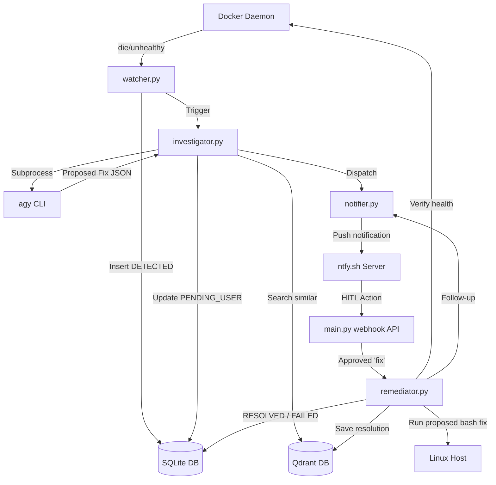

# AutoHeal SRE MonitorBot (L3 Autonomous SRE Assistant)

AutoHeal is an event-driven Python application designed to run natively on a Linux host. It monitors Docker containers, utilizes the `agy` (Antigravity) CLI via subprocesses to investigate failures and propose fixes, and coordinates human-in-the-loop (HITL) approvals via `ntfy` push notifications. It features a RAG (Retrieval-Augmented Generation) memory system using Qdrant to learn from past incidents.

## Features

- **Non-Polling Docker Monitor:** Listens to the Docker daemon event stream for container crashes (`die` events with non-zero exit codes) or container `health_status: unhealthy` events.
- **Systemd Host Service Monitoring:** Polls host services (like `plexmediaserver` or `ssh`) via `systemctl` periodically (configurable in `.env`) to detect failures outside container scopes.
- **Autonomous AI Investigator:** Invokes the local `agy` CLI in a subprocess to dynamically analyze container logs or journalctl streams, identify root causes, and propose bash-script remediation commands.
- **Loop Prevention (Circuit Breaker):** If a target fails $\ge 2$ times in a rolling 60-minute window, automatic fixes are blocked, and a critical alert is sent to prevent resource-exhausting restart loops.
- **Command Safety Validation:** Scans proposed fixes against a blacklist to block destructive operations (recursive `rm`, volume prunes, host reboots) before execution under Autopilot.
- **Dependency-Aware Remediation:** Queueing fixes behind failed dependencies (e.g. holding web app fixes until database container incidents are resolved first) to prevent cascade failures.
- **Uptime Kuma Web Probes:** Verifies resolution health by polling target external URLs parsed from `kuma.<service>.http.url` container labels, falling back to process status checks.
- **Semantic Memory (RAG):** Integrates Qdrant vector database using `fastembed` to store successful resolutions, enabling semantic retrieval of past decisions directly from the CLI or automated context injection.
- **Heartbeat Status Checks:** Dispatches high-priority (DND-bypassing) heartbeats at startup and every 4 hours (default) to confirm SRE bot health.
- **Interactive Push Alerts:** Delivers rich push notifications using `ntfy` with Action Buttons, allowing administrators to approve fixes, defer alerts, or ignore targets directly from their mobile devices or desktop.
- **Web Dashboard:** Serves an interactive HTML dashboard built with FastAPI, SQLAlchemy (SQLite), and Tailwind CSS to track active incidents, view resolution histories, and manage target ignore/defer states.

---

## Semantic Memory CLI Commands

You can interact with SRE Memory database using `cli.py`:

```bash
# List all successful fixes stored in the vector database
python3 cli.py memory list

# Search past incidents using semantic natural language
python3 cli.py memory search "permission error on databases"

# Manually teach the SRE bot a successful manual fix
python3 cli.py memory learn --target postgres --cause "out of memory" --fix "docker restart postgres"
```

---

## Directory Structure

```
monitorbot/
├── app/
│   ├── database.py       # SQLAlchemy database schema and session management
│   ├── investigator.py   # AI subprocess executor calling agy CLI
│   ├── main.py           # FastAPI entrypoint and HTTP API routes
│   ├── notifier.py       # ntfy notification dispatcher with fallback support
│   ├── qdrant_mem.py     # Qdrant client vector store & semantic search
│   ├── remediator.py     # Auto-remediation script and health verification
│   ├── scheduler.py      # APScheduler job to manage deferred/ignored targets
│   ├── watcher.py        # Non-polling Docker SDK event stream listener
│   └── templates/
│       └── index.html    # Web dashboard UI
├── .env                  # Configuration variables
├── .env.example          # Sample environment variables
├── monitorbot.service    # Systemd service configuration file
├── run.sh                # Application startup script
└── README.md             # This file
```

---

## Technical Architecture



---

## Configuration & Environment Variables

Create a `.env` file in the root of the repository:

```env
DATABASE_URL=sqlite:////containers/monitorbot/monitorbot.db
NTFY_URL=https://ntfy.wileyriley.com
NTFY_TOPIC=alerts
NTFY_USER=your_ntfy_username
NTFY_PASS=your_ntfy_password
WEBHOOK_BASE_URL=https://your-monitorbot-domain.com
WEBHOOK_TOKEN=your_secure_webhook_token
PORT=9013
HOST=0.0.0.0
AGY_PATH=/home/steve/.local/bin/agy
```

---

## Setup & Running

### Natively on Host
1. **Initialize and Activate Virtual Environment:**
   ```bash
   python3 -m venv venv
   source venv/bin/activate
   pip install -r requirements.txt # (or install dependencies: fastapi uvicorn docker sqlalchemy qdrant-client fastembed requests apscheduler jinja2)
   ```
2. **Run manually:**
   ```bash
   ./run.sh
   ```

### Managing via systemd
To run MonitorBot continuously as a systemd service:
1. **Install service unit:**
   ```bash
   sudo cp monitorbot.service /etc/systemd/system/
   sudo systemctl daemon-reload
   ```
2. **Enable and Start:**
   ```bash
   sudo systemctl enable monitorbot.service
   sudo systemctl start monitorbot.service
   ```
3. **Verify Status:**
   ```bash
   systemctl status monitorbot.service
   journalctl -u monitorbot.service -f
   ```

---

## Resiliency Features

### Local Failover & Outage Recovery (SMTP & Auto-Approval)
In the event that external domain resolution, internet access, or the Caddy reverse proxy is down:
1. **Direct SMTP Email Fallback:** If `NTFY_URL` (e.g. `https://ntfy.wileyriley.com`) is unreachable or returns HTTP errors, MonitorBot automatically skips to sending an SMTP email to the system administrator with full incident diagnostics.
2. **Local LAN & One-Click Fix Links:** Email notifications embed direct local IP links (`http://10.0.0.10:9013/api/webhooks/<ID>?token=<TOKEN>&action=fix`) and copy-pasteable `curl` commands so fixes can be triggered locally without domain name resolution.
3. **Automatic Reverse Proxy Auto-Approval Exception:** If external domain connectivity probes fail **and** the issue is identified as a Caddy/Caddyfile or reverse proxy failure, MonitorBot automatically approves and executes the AI remediation without waiting for manual user approval.

