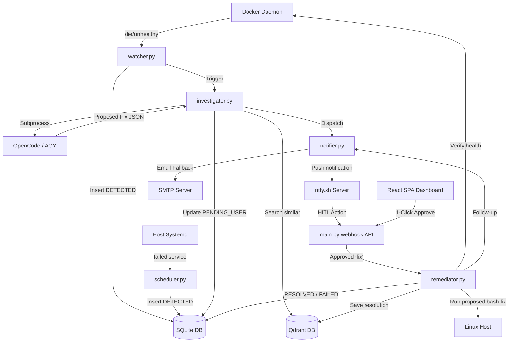

# AutoHeal SRE MonitorBot (L3 Autonomous SRE Assistant)

AutoHeal is an event-driven Python application designed to run natively on a Linux host. It monitors Docker containers and host systemd services, utilizes AI investigation engines (`opencode` / `agy`) to analyze root causes and propose fixes, coordinates human-in-the-loop (HITL) approvals via `ntfy` push alerts and interactive web UI, and features a RAG (Retrieval-Augmented Generation) memory system using Qdrant vector search.

---

## Key Features

- **Non-Polling Docker Monitor:** Listens directly to the Docker daemon event stream for container crashes (`die` events with non-zero exit codes) or container `health_status: unhealthy` events.
- **Systemd Host Service Monitoring:** Polls host services (like `plexmediaserver`, `adguardhome`, or `ssh`) via `systemctl` periodically to detect failures outside container scopes.
- **Autonomous AI Investigator:** Invokes local AI engines (`opencode` via HTTP API `:8447` or `agy` CLI) in a subprocess to dynamically analyze container logs and journalctl streams, identify root causes, and propose bash remediation scripts.
- **Modern React + TypeScript SPA Dashboard:** Built with Vite and structured Light/Dark Green CSS theme, serving real-time SRE incident queues, 1-click approvals, canary audit trees, token analytics, and system maintenance controls.
- **Autonomous Container Upgrades Engine:** Orchestrates stack-by-stack or full-infrastructure container updates (`docker compose pull -> up -> prune`), runs 4-phase Canary Health Audits, and immediately triggers AI self-healing if a container crashes post-upgrade.
- **Loop Prevention (Circuit Breaker):** If a target fails $\ge 2$ times in a rolling 60-minute window, automatic fixes are blocked, and a critical alert is dispatched to prevent resource-exhausting restart loops.
- **Command Safety Validation:** Scans proposed fixes against a blacklist to block destructive operations (recursive `rm`, volume prunes, host reboots) before execution under Autopilot.
- **Dependency-Aware Remediation:** Queues fixes behind failed dependencies (e.g. holding web app fixes until database container incidents are resolved first) to prevent cascade failures.
- **Uptime Kuma Web Probes:** Verifies resolution health by polling target external URLs parsed from `kuma.<service>.http.url` container labels, falling back to process status checks.
- **Semantic Memory (RAG):** Integrates Qdrant vector database using `fastembed` to store successful resolutions, enabling semantic retrieval of past decisions directly from the CLI or automated context injection.
- **Multi-Channel Notifications & Failover:** Dispatches rich `ntfy` push alerts with action buttons, Telegram bot alerts, and direct SMTP email fallbacks with local LAN one-click URLs if external reverse proxies fail.
- **AI Spend & Token Tracker:** Real-time analytics tracking OpenCode/LiteLLM/Gemini token counts, estimated dollar costs ($ USD), model distribution, and per-incident costs.

---

## Frontend SPA Dashboard

The web dashboard is served directly at `http://10.0.0.10:9013/` (or via reverse proxy). It is organized into 6 dedicated views:

1. **Active Incidents (`/`):** Real-time queue of ongoing incidents with severity tags, error logs, root cause analysis, proposed bash scripts, and 1-click Approve / Defer / Ignore buttons.
2. **Incident History (`/history`):** Complete audit log of resolved, failed, and suppressed incidents with execution logs and completion timestamps.
3. **Autonomous Upgrade Hub (`/upgrades`):** Interactive interface to trigger single-stack or full-infrastructure container updates, watch live streaming terminal output, and inspect 4-phase Canary Health Audits.
4. **AI Spend & Token Tracker (`/spend`):** Analytics breakdown displaying total AI spend ($ USD), input/output token volume, model distribution, and per-incident cost tables.
5. **Targets & Fleet Management (`/targets`):** Master view of all monitored Docker containers and systemd services, with status indicators and temporary ignore duration toggles.
6. **Memory & Knowledge Search (`/memory`):** Semantic search engine over Qdrant vector memory to query past incident root causes, lessons learned, and verified fixes.

---

## Semantic Memory & CLI Commands

You can interact with the SRE Memory database, maintenance modes, and fleet status using `cli.py`:

```bash
# List all successful fixes stored in the vector database
python3 cli.py memory list

# Search past incidents using semantic natural language
python3 cli.py memory search "permission error on databases"

# Manually teach the SRE bot a successful manual fix
python3 cli.py memory learn --target postgres --cause "out of memory" --fix "docker restart postgres"

# Pause monitoring temporarily (e.g. during maintenance or manual updates)
python3 cli.py pause 30m
python3 cli.py pause indefinite
python3 cli.py resume

# Check overall bot and fleet status
python3 cli.py status
```

---

## Directory Structure

```
monitorbot/
├── app/
│   ├── routers/          # Modular FastAPI routers (incidents, upgrades, settings, usage)
│   ├── database.py       # SQLAlchemy database schema and session management
│   ├── investigator.py   # AI subprocess executor calling OpenCode / agy
│   ├── upgrades.py       # Autonomous upgrades manager & Canary health auditor
│   ├── ai_usage.py       # AI token consumption & spend tracker
│   ├── main.py           # FastAPI entrypoint, router mounts & static asset server
│   ├── notifier.py       # ntfy notification dispatcher with fallback support
│   ├── qdrant_mem.py     # Qdrant client vector store & semantic search
│   ├── remediator.py     # Auto-remediation script and health verification
│   ├── scheduler.py      # APScheduler job to manage deferred/ignored targets
│   ├── telegram_bot.py   # Telegram notification dispatcher
│   └── watcher.py        # Non-polling Docker SDK event stream listener
├── frontend/             # Modern React + TypeScript + Vite SPA
│   ├── src/
│   │   ├── styles/       # Traditional structured CSS (Light/Dark Green Theme)
│   │   ├── components/   # Modular UI components (Navbar, CanaryAuditCard, Terminal, etc.)
│   │   ├── views/        # Views (ActiveIncidents, UpgradeHub, SpendTracker, etc.)
│   │   ├── hooks/        # Custom state hooks (useIncidents, useUpgrades, useSettings)
│   │   └── types/        # TypeScript type definitions
│   ├── dist/             # Compiled production bundle
│   └── vite.config.ts
├── tests/                # Comprehensive unit, integration, and live test suites
├── .env                  # Configuration variables
├── monitorbot.service    # Systemd service configuration file
├── run.sh                # Application startup & auto-build script
├── TESTING.md            # Detailed test coverage & quality assurance guide
└── README.md             # This file
```

---

## Technical Architecture


```mermaid
graph TD
    Docker[Docker Daemon] -->|die/unhealthy| Watcher[watcher.py]
    Systemd[Host Systemd] -->|failed service| Scheduler[scheduler.py]
    Watcher -->|Insert DETECTED| DB[(SQLite DB)]
    Scheduler -->|Insert DETECTED| DB
    Watcher -->|Trigger| Investigator[investigator.py]
    Investigator -->|Search similar| Qdrant[(Qdrant DB)]
    Investigator -->|Subprocess| OpenCode[OpenCode / AGY]
    OpenCode -->|Proposed Fix JSON| Investigator
    Investigator -->|Update PENDING_USER| DB
    Investigator -->|Dispatch| Notifier[notifier.py]
    Notifier -->|Push notification| Ntfy[ntfy.sh Server]
    Notifier -->|Email Fallback| SMTP[SMTP Server]
    Ntfy -->|HITL Action| Webhook[main.py webhook API]
    Frontend[React SPA Dashboard] -->|1-Click Approve| Webhook
    Webhook -->|Approved 'fix'| Remediator[remediator.py]
    Remediator -->|Run proposed bash fix| Host[Linux Host]
    Remediator -->|Verify health| Docker
    Remediator -->|RESOLVED / FAILED| DB
    Remediator -->|Save resolution| Qdrant
    Remediator -->|Follow-up| Notifier
```

---

## Configuration & Environment Variables

Create a `.env` file in the root of `/containers/monitorbot/`:

```env
DATABASE_URL=sqlite:////containers/monitorbot/monitorbot.db
NTFY_URL=https://ntfy.wileyriley.com
NTFY_TOPIC=alerts
NTFY_USER=your_ntfy_username
NTFY_PASS=your_ntfy_password
WEBHOOK_BASE_URL=https://monitorbot.wileyriley.com
WEBHOOK_TOKEN=your_secure_webhook_token
PORT=9013
HOST=0.0.0.0
OPENCODE_SERVER_URL=http://localhost:8447
OPENCODE_PATH=/usr/local/bin/opencode
AGY_PATH=/home/steve/.local/bin/agy
```

---

## Setup & Running

### Managing via systemd (Recommended)
To run MonitorBot continuously as a systemd service:
```bash
# 1. Install service unit:
sudo cp monitorbot.service /etc/systemd/system/
sudo systemctl daemon-reload

# 2. Enable and Start:
sudo systemctl enable monitorbot.service
sudo systemctl start monitorbot.service

# 3. Check status and logs:
systemctl status monitorbot.service
journalctl -u monitorbot.service -f
```

### Running Manually
```bash
# Build frontend and start FastAPI server
./run.sh
```

---

## Resiliency Features

### Local Failover & Outage Recovery (SMTP & Auto-Approval)
In the event that external domain resolution, internet access, or the Caddy reverse proxy is down:
1. **Direct SMTP Email Fallback:** If `NTFY_URL` is unreachable or returns HTTP errors, MonitorBot automatically falls back to sending an SMTP email to the administrator with full incident diagnostics.
2. **Local LAN & One-Click Fix Links:** Email notifications embed direct local IP links (`http://10.0.0.10:9013/api/webhooks/<ID>?token=<TOKEN>&action=fix`) and copy-pasteable `curl` commands so fixes can be triggered locally without domain name resolution.
3. **Automatic Reverse Proxy Auto-Approval Exception:** If external domain connectivity probes fail **and** the issue is identified as a Caddy/Caddyfile or reverse proxy failure, MonitorBot automatically approves and executes the AI remediation without waiting for manual user approval.

---

## Testing & Quality Assurance

MonitorBot features a comprehensive test suite with **80% total statement coverage** and **129 passed unit/integration tests**.

For detailed testing guidelines, safety procedures, and module metrics, see [`TESTING.md`](TESTING.md).

```bash
# Run isolated unit & integration test suite:
pytest -m "not live"

# Run tests with code coverage report:
pytest -m "not live" --cov=app --cov-report=term-missing

# Run live E2E integration tests (explicit invocation only):
pytest tests/test_live_executors.py -v -s
```
