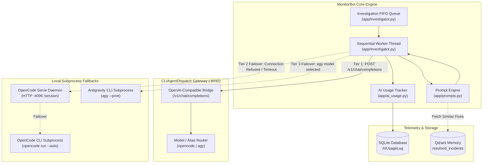
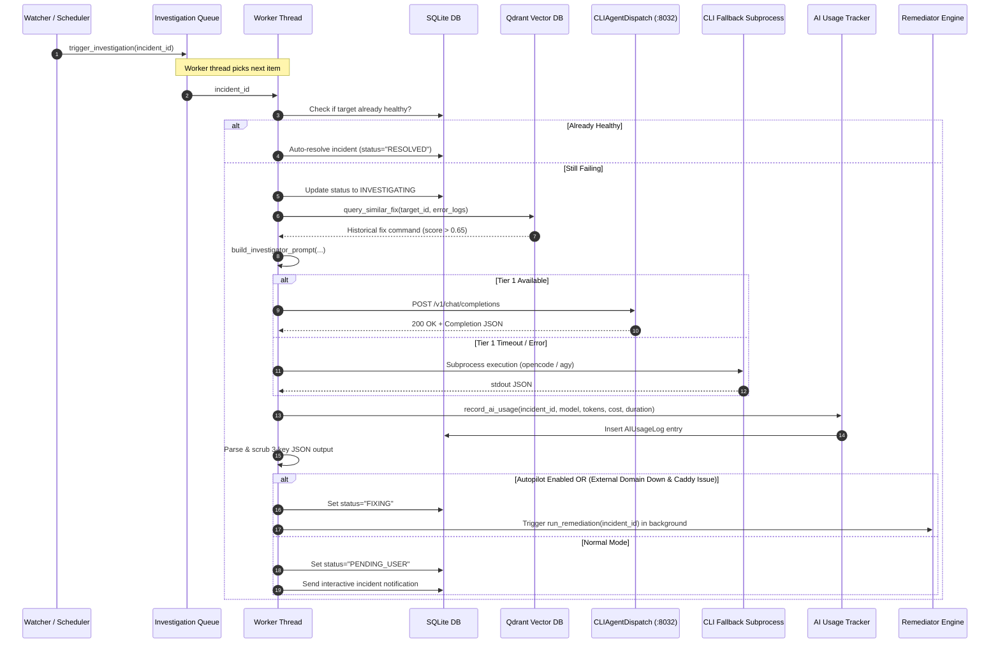

# AI Agent Delegation & Dispatch Architecture

MonitorBot delegates complex incident root-cause analysis and remediation planning to local AI coding agents. To prevent model thrashing, avoid slow process startup latency, and ensure zero downtime even if an AI agent daemon is restarting, MonitorBot employs a multi-tiered delegation architecture backed by `CLIAgentDispatch` and an asynchronous single-threaded queue.

---

## Delegation Topology

The AI delegation pipeline provides an OpenAI-compatible HTTP interface on port `8032`, wrapping underlying CLI coding assistants (`opencode` and `agy`) while maintaining seamless local process fallback capabilities.



---

## The Three-Tier Execution Hierarchy

To guarantee incident investigation survives network splits, daemon crashes, or process restarts, `app/investigator.py` executes prompts across three prioritized tiers:

### Tier 1: `CLIAgentDispatch` HTTP Gateway (Port `8032`)
The primary interface is `call_ai_dispatch_server()`, querying `http://localhost:8032/v1/chat/completions`:
- **Protocol**: Standard OpenAI REST schema (`POST /v1/chat/completions`).
- **Payload**:
  ```json
  {
    "model": "opencode",
    "messages": [
      {
        "role": "user",
        "content": "... enriched incident prompt ..."
      }
    ],
    "temperature": 0.2
  }
  ```
- **Advantages**: Connection pooling, centralized concurrency throttling, low invocation latency, and unified token tracking across homelab agents.
- **Timeout**: Governed by `AI_DISPATCH_TIMEOUT` (default: 180 seconds).

### Tier 2: Headless OpenCode Daemon (Port `4096`) & OpenCode CLI
If `CLIAgentDispatch` is unavailable or returns an HTTP error, the system evaluates `AI_MODEL`:
1. If an active `opencode serve` daemon is responding at `http://localhost:4096`, MonitorBot creates an ephemeral session via `POST /session` and submits messages via `POST /session/{session_id}/message`.
2. If the daemon is offline, MonitorBot spawns a direct headless subprocess:
   ```bash
   /home/steve/.nvm/versions/node/v22.17.0/bin/opencode run \
     --auto \
     --model litellm/qwen3.7-flash \
     "<prompt>"
   ```

### Tier 3: Antigravity CLI Subprocess (`agy`)
When `AI_MODEL` specifies `agy` or when configured as the primary executor, MonitorBot invokes the Antigravity command-line interface:
```bash
/home/steve/.local/bin/agy \
  --model "Gemini 3.5 Flash (Medium)" \
  --dangerously-skip-permissions \
  --print \
  "<prompt>"
```
- **Execution Mode**: Non-interactive stream (`--print`) with permissions automatically bypassed (`--dangerously-skip-permissions`) so the model can inspect host files and execute diagnostic commands autonomously.

---

## Investigation Sequence

The entire end-to-end investigation lifecycle is serialized via an in-memory FIFO queue to protect LLM quota and CPU limits:



---

## Model Aliases & Configuration

MonitorBot reads AI routing and model identifiers from environment variables:

| Environment Variable | Default Value | Description |
| :--- | :--- | :--- |
| `AI_DISPATCH_URL` | `http://localhost:8032/v1` | URL for the centralized CLIAgentDispatch OpenAI gateway. |
| `AI_MODEL` | `opencode` | Target model identifier or dispatch alias (`opencode`, `agy`, `litellm/qwen3.7-flash`). |
| `AI_DISPATCH_TIMEOUT`| `180` | Maximum seconds to wait for CLIAgentDispatch HTTP response before triggering fallback. |
| `AI_EXECUTOR` | `opencode` | Primary fallback executor selector (`opencode` or `agy`). |
| `OPENCODE_SERVER_URL`| `http://localhost:4096` | Headless OpenCode HTTP daemon endpoint. |
| `OPENCODE_MODEL` | `litellm/qwen3.7-flash`| Provider and model specifier passed to OpenCode. |
| `OPENCODE_PATH` | `/home/steve/.nvm/versions/node/v22.17.0/bin/opencode` | Absolute path to OpenCode binary. |
| `AGY_PATH` | `/home/steve/.local/bin/agy` | Absolute path to Antigravity CLI binary. |
| `AGY_MODEL` | `Gemini 3.5 Flash (Medium)` | Model configuration string passed to `agy --model`. |

---

## AI Usage Tracking & Cost Analytics

Every AI invocation—whether handled via `CLIAgentDispatch` or local CLI fallback—is audited in the `AIUsageLog` SQLite table by `app/ai_usage.py`.

### Token Estimation & Pricing Model

For models that do not return explicit token headers over standard output, tokens are estimated using the standard heuristic ($4 \text{ characters} \approx 1 \text{ token}$):

$$\text{Estimated Tokens} = \max\left(1, \left\lfloor\frac{\text{length}(\text{text})}{4}\right\rfloor\right)$$

Costs are calculated per 1 million tokens based on model rate tiers:

| Model ID / Alias | Input Rate / 1M Tokens | Output Rate / 1M Tokens |
| :--- | :--- | :--- |
| `qwen3.7-flash` | $0.05 | $0.15 |
| `qwen3.5-flash-02-23` | $0.10 | $0.20 |
| `gemini-2.5-flash` | $0.075 | $0.30 |
| `Gemini 3.5 Flash (Medium)` | $0.15 | $0.60 |
| `Gemini 3.7 Flash (High)` | $0.25 | $1.00 |
| `gpt-4o-mini` | $0.15 | $0.60 |
| `default` fallback | $0.10 | $0.25 |

### Database Schema (`AIUsageLog`)

```sql
CREATE TABLE ai_usage_logs (
    id VARCHAR PRIMARY KEY,
    incident_id VARCHAR,
    executor VARCHAR,         -- 'dispatch', 'opencode', 'agy'
    model_id VARCHAR,         -- e.g. 'litellm/qwen3.7-flash'
    prompt_tokens VARCHAR,
    completion_tokens VARCHAR,
    total_tokens VARCHAR,
    cost_usd VARCHAR,         -- formatted as decimal string (e.g. '0.000412')
    duration_sec VARCHAR,     -- seconds taken for model inference
    status VARCHAR,           -- 'SUCCESS' or 'FAILED'
    created_at DATETIME
);
```

### Analytics Endpoint (`/api/usage/summary`)

The dashboard queries `/api/usage/summary` to render live cost breakdowns:
```json
{
  "total_spend_usd": 0.142850,
  "total_calls": 84,
  "total_tokens": 312450,
  "by_model": {
    "litellm/qwen3.7-flash": { "calls": 72, "tokens": 268000, "cost": 0.089200 },
    "Gemini 3.5 Flash (Medium)": { "calls": 12, "tokens": 44450, "cost": 0.053650 }
  },
  "by_executor": {
    "dispatch": 78,
    "opencode": 4,
    "agy": 2
  }
}
```
