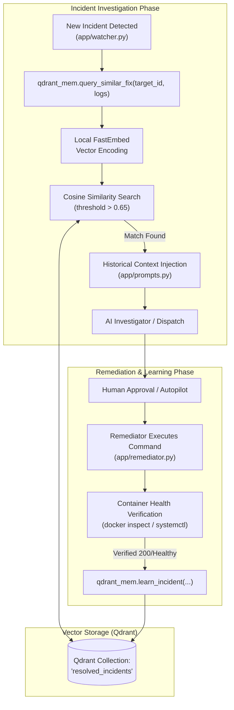

# Vector Semantic Memory & RAG Retrieval

MonitorBot incorporates a Retrieval-Augmented Generation (RAG) semantic memory system powered by **Qdrant** and local **FastEmbed** embeddings (`app/qdrant_mem.py`). By storing historical incident root causes and verified remediation commands as high-dimensional vector embeddings, MonitorBot continuously learns from past incidents and accelerates resolution for recurring failures.

---

## Semantic Memory Architecture

When an incident is successfully remediated, MonitorBot vectorizes the error signature and stores the solution. When a future incident occurs on any service, MonitorBot performs a cosine similarity search against this vector collection to find relevant historical precedents.



---

## Dual-Mode Qdrant Storage

MonitorBot supports both standalone homelab deployments and centralized container stacks through a dual-mode connection strategy:

1. **Remote Container Mode** (`QDRANT_URL` defined):
   Connects to a centralized Qdrant server, typically hosted at `http://localhost:8010` as part of the homelab's shared infrastructure:
   ```python
   self.client = QdrantClient(url=os.getenv("QDRANT_URL"))
   ```
2. **Local Embedded File Storage Mode** (`QDRANT_URL` empty):
   Persists vectors directly to the host filesystem at `/containers/monitorbot/qdrant_data`:
   ```python
   self.client = QdrantClient(path="/containers/monitorbot/qdrant_data")
   ```

### Collection Initialization & FastEmbed

The collection (`resolved_incidents`) is automatically created upon first startup using Qdrant's integrated `FastEmbed` provider. FastEmbed generates dense sentence embeddings locally without external API dependencies or GPU acceleration:

```python
if not self.client.collection_exists("resolved_incidents"):
    self.client.create_collection(
        collection_name="resolved_incidents",
        vectors_config=self.client.get_fastembed_vector_params()
    )
```

---

## Vector Schema & Metadata Payload

Each point stored in the `resolved_incidents` collection contains a synthesized incident document and structured metadata:

### Document Vector String
The natural language text converted to embeddings combines the target, cause, and verified command:
```
Error on <target_id>. Cause: <root_cause>. Fix: <proposed_fix>.
```

### Metadata Payload Schema
```json
{
  "target_id": "kopia",
  "target_type": "docker",
  "successful_command": "docker compose restart kopia && chown -R 1000:1000 /mnt/backups"
}
```

---

## Cosine Similarity Search & Prioritization

During an investigation, `app/investigator.py` calls `query_similar_fix()`:

```python
results = self.client.query(
    collection_name="resolved_incidents",
    query_text=error_logs,
    query_filter=Filter(
        should=[
            FieldCondition(
                key="target_id",
                match=MatchValue(value=target_id)
            )
        ]
    ),
    limit=1
)
```

### Search Heuristics & Filtering
- **Soft Target Prioritization (`should`)**: The search favors past fixes for the same container (`target_id`), but still matches relevant cross-container errors (e.g., general Postgres connection limits or Caddy reverse proxy handshake timeouts).
- **Similarity Threshold (`score > 0.65`)**: Matches with cosine similarity scores below `0.65` are rejected to prevent hallucinated or irrelevant suggestions from biasing the LLM.

---

## Prompt Injection Contract

When a historical match exceeds the similarity threshold, MonitorBot synthesizes an advisory context block injected into the prompt:

```text
Historical context: In the past, a similar issue on this container was successfully fixed using this command: docker compose restart kopia && chown -R 1000:1000 /mnt/backups. Take this into consideration when proposing your fix.
```

This ensures the AI model leverages proven, battle-tested solutions while remaining free to propose alternative actions if logs show a distinct root cause.

---

## The Continuous Learning Loop

Learning is triggered only **after** empirical verification of container health:

1. **Fix Execution**: `app/remediator.py` executes the proposed bash command.
2. **Post-Remediation Verification**: MonitorBot sleeps 5 seconds and probes the container's live Docker status (`Running == True`) and health status (`healthy` or `none`).
3. **Writeback**: Only if the container is verified operational does `learn_incident()` commit the solution to Qdrant:
   ```python
   qdrant_mem.learn_incident(
       incident_id=incident.id,
       target_id=incident.target_id,
       root_cause=incident.root_cause,
       proposed_fix=incident.proposed_fix
   )
   ```

---

## CLI Semantic Memory Management

MonitorBot provides built-in CLI commands in `cli.py` to inspect, search, and manually populate the semantic vector database:

### 1. List All Learned Memories
```bash
python3 cli.py memory list
```
*Output:*
```text
--- Learned Memories in Qdrant (4 total) ---

ID:       f8d1e39a-563b-411a-8289-53744cf21d22
Target:   kopia (docker)
Fix Cmd:  docker compose restart kopia

ID:       3a12cd6b-8714-4632-95b1-12f716aa831b
Target:   authentik-server (docker)
Fix Cmd:  docker compose exec -T postgres vacuumdb -U authentik -d authentik --analyze
--------------------------------------------------
```

### 2. Semantic Search for Fixes
```bash
python3 cli.py memory search "database connection reset by peer"
```
*Output:*
```text
--- Semantic Search Results for: 'database connection reset by peer' ---

Score:    0.8124
Target:   authentik-server
Fix Cmd:  docker compose restart postgres && docker compose restart authentik-server
--------------------------------------------------
```

### 3. Manually Teach a Fix
To manually seed memory with an institutional runbook fix:
```bash
python3 cli.py memory learn \
  --target "frigate" \
  --cause "Coral USB TPU bus locked up after host wake" \
  --fix "rmmod apex && modprobe apex && docker compose restart frigate"
```
