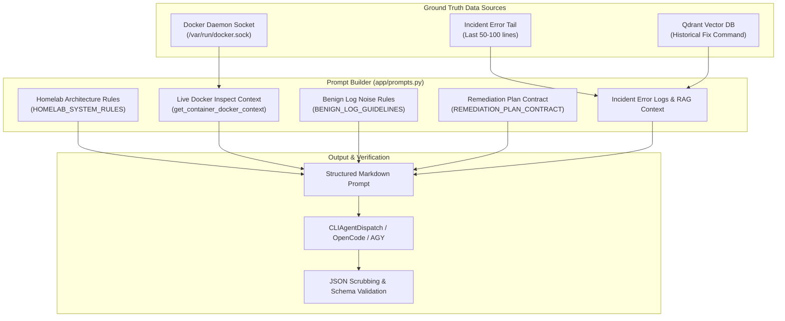

# AI Prompt Engineering & Context Contracts

The accuracy and safety of AI-driven remediation depend on rigorous prompt construction and strict output schema enforcement. MonitorBot's prompt engine (`app/prompts.py`) enriches raw error logs with live Docker daemon metadata, homelab architectural conventions, benign noise suppression guidelines, and hardcoded safety guardrails before invoking any AI model.

---

## Prompt Architecture & Synthesis Pipeline

When an incident is diagnosed or a scheduled SRE audit is executed, `app/prompts.py` builds an enriched prompt context:



---

## 1. Homelab System Architecture Rules

The AI model is supplied with structural ground rules defining the physical and logical layout of the homelab environment:

```text
=== Homelab Infrastructure Architecture & Rules ===
1. Server Host IP: 10.0.0.10 (Linux host running Docker Compose & systemd).
2. Stack Root Paths: All Docker Compose stacks are located in '/containers/<category>/docker-compose.yaml'.
3. Reverse Proxy: Caddy is the universal reverse proxy. Dynamic routes are managed via container labels ('caddy=...'), and static routes live in '/containers/webservices/caddy/Caddyfile'. NOTE: Nginx / SWAG is deprecated and NOT used. NEVER generate Nginx directives (such as 'proxy_buffering', 'proxy_read_timeout', 'proxy_pass', etc.) or search deprecated Nginx paths.
4. Authentication & SSO: TinyAuth ('tinyauth.apps.*' labels) and PocketID provide forward-auth and OIDC.
5. Local DNS: AdGuard Home at 10.0.0.2 (pi@adguard). Public wildcard is '*.wileyriley.com'.
6. MCP Router & Knowledge Hub:
   - MCP Gateway Router: http://10.0.0.10:8026/sse (X-App-Key: mcp-global-steve-default-cli-key-99)
   - Knowledge / Notes RAG (ContextCortex): Direct fallback at http://10.0.0.10:8021/sse if router is unavailable.
```

### Purpose & Impact
- Prevents hallucination of non-existent hosts or cloud APIs.
- Blocks outdated SWAG/Nginx suggestions by explicitly declaring Caddy as the sole reverse proxy.
- Directs file modifications exclusively to `/containers/<category>/`.

---

## 2. Live Docker Ground-Truth Metadata

Rather than forcing the model to guess image tags, working directories, or port allocations, `get_container_docker_context()` extracts live container attributes from the Docker daemon socket:

```python
c = client.containers.get(container_name)
labels = c.attrs.get("Config", {}).get("Labels", {})
project = labels.get("com.docker.compose.project", "unknown")
working_dir = labels.get("com.docker.compose.project.working_dir", f"/containers/{project}")
config_files = labels.get("com.docker.compose.project.config_files", f"{working_dir}/docker-compose.yaml")
status = c.status
health = c.attrs.get("State", {}).get("Health", {}).get("Status", "none")
image = c.attrs.get("Config", {}).get("Image", "")
```

### Injected Context Block Example
```text
=== Live Container Ground Truth: 'audiobookshelf' ===
Stack Name: media_audio
Compose File: /containers/media_audio/docker-compose.yaml
Status: restarting (Health: unhealthy)
Image: ghcr.io/advplyr/audiobookshelf:latest
```

For stack-wide audits, `get_stack_docker_context()` maps all sibling containers, host-to-container port bindings, and compose paths.

---

## 3. Benign Noise & False-Positive Guidelines

Homelab logs contain high volumes of non-fatal informational warnings. `BENIGN_LOG_GUIDELINES` prevents false alarm storms:

| Pattern | Cause | Required AI Classification |
| :--- | :--- | :--- |
| **TinyAuth 401s** | `status=401` on `/api/auth/` | Normal unauthenticated browser/crawler requests prior to login. Mark benign (`action_required: false`). |
| **OpenIddict / MCP Probes** | 401 challenges during token negotiation | Normal protocol handshake. Mark benign. |
| **MCP SSE Reconnects** | `idle connection timeout (normal)` | Client disconnection in LibreChat or OpenCode. Mark benign. |
| **Proxied Internal Services** | Warnings about unencrypted HTTP on loopback (Glances, Portainer) | Intentionally unauthenticated locally because Caddy and TinyAuth enforce edge security. Mark benign. |
| **Sleeping Smart Devices** | Timeouts to smart TVs (`10.0.0.230`, `10.0.0.39`) or battery sensors | Device is simply powered off or in deep sleep. Mark benign. |
| **SSH / Terminal Disconnects** | `ECONNRESET` / `SIGPIPE` in Guacamole or Termix | User closed browser tab. Mark benign. |
| **Local Custom Images in WUD**| `404 NAME_UNKNOWN` in Whats-Up-Docker | Container built locally, not published to Docker Hub. Mark benign. |
| **DB Startup Synchronization**| `FATAL: the database system is starting up` | Application started before Postgres/MySQL completed boot. Mark benign. |
| **Deprecation Warnings** | Informational MySQL `mysql_native_password` or Node notices | Non-breaking deprecations. Mark benign. |
| **Scraper Rate Limits** | HTTP 403 or CAPTCHAs in SearXNG | Upstream search engine rate limits. Mark benign. |

---

## 4. Remediation Plan Contract & Guardrails

The remediation contract enforces safe, deterministic commands and protects databases from automated corruption:

### Critical Safety Guardrails
1. **NO RAW SQL MUTATIONS**:
   The model is strictly prohibited from generating raw SQL `DELETE`, `DROP`, or `UPDATE` commands on application SQLite or PostgreSQL databases (e.g., Jellyseerr, Plex, Home Assistant). Application databases must only be managed via official web interfaces, migrations, or container recreation.
2. **NO BRITTLE REGEX / SED COMPOSITION**:
   The model must not use `sed` to edit `docker-compose.yaml` or `.env` files (e.g., `sed -i 's/auth: true/auth: false/'`). It must propose clean compose commands or clear human configuration steps.
3. **NO PLACEHOLDER STRINGS**:
   Commands must contain real paths and real service names. Tokens like `<target-host-ip>`, `example.com`, or `<id>` cause validation rejection.
4. **NO MARKDOWN ENCLOSURES IN KEYS**:
   Raw JSON keys must not contain backticks, formatting, or fences.

---

## 5. Output Schemas

### Reactive Incident Output Schema (`build_investigator_prompt`)

MonitorBot demands an exact three-key JSON dictionary:

```json
{
  "root_cause": "Detailed technical explanation of what failed and why (1-3 sentences).",
  "proposed_fix": "cd /containers/media_audio && docker compose restart audiobookshelf",
  "category": "permissions"
}
```

#### Valid Category Identifiers:
- `network`: DNS failures, connection refused, port collisions, host unreachable.
- `reverse_proxy`: Caddy route mismatch, TLS handshake error, upstream timeout.
- `permissions`: UID/GID mismatches, read-only filesystem, file mode errors (`EACCES`).
- `settings`: Configuration file syntax error, missing environment variable.
- `database`: DB connection exhausted, corrupt SQLite file, lock timeout.
- `unknown`: Unclassified issues.

---

### Daily SRE Audit Output Schema (`build_sre_audit_prompt`)

For stack-wide log audits, the model outputs container-level evaluations:

```json
{
  "containers": {
    "authentik-server": {
      "root_cause": "PostgreSQL connection pool exhausted due to spike in background tasks.",
      "proposed_fix": "cd /containers/webservices && docker compose restart authentik-worker authentik-server",
      "category": "database_error",
      "action_required": true
    },
    "authentik-redis": {
      "root_cause": "Benign cache eviction warnings within normal memory constraints.",
      "proposed_fix": "None required.",
      "category": "transient_warning",
      "action_required": false
    }
  },
  "overall_summary": "Authentik service degraded due to database connection pool exhaustion; redis cache is healthy."
}
```

---

## JSON Parsing & Scrubbing Engine

In `app/investigator.py`, raw model output is processed by a resilient extractor:

```python
# Regular expression extracts outermost JSON block, stripping any chat preamble
json_match = re.search(r"\{.*\}", output, re.DOTALL)
if not json_match:
    raise ValueError("No JSON block found in output")

clean_json_str = json_match.group(0)
data = json.loads(clean_json_str)

root_cause = data.get("root_cause")
proposed_fix = data.get("proposed_fix")
category = data.get("category", "unknown")

if not root_cause or not proposed_fix:
    raise ValueError("Missing 'root_cause' or 'proposed_fix' in JSON")
```

If the JSON fails to parse or violates the schema, the incident is marked `FAILED` with the raw output logged for administrative review.
