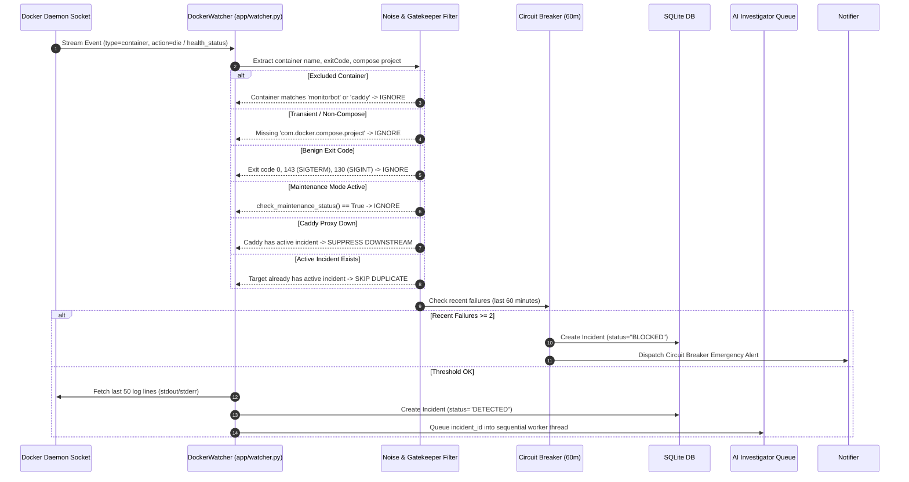
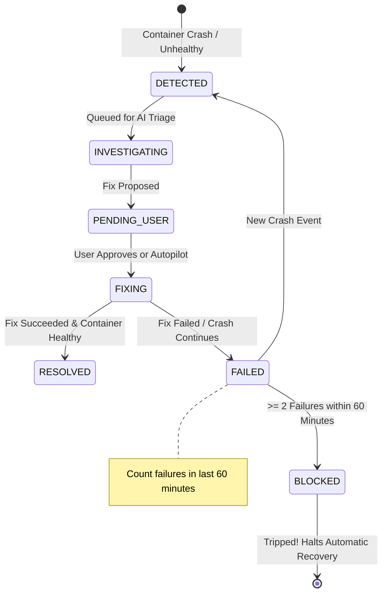

# Docker Socket Event Watcher

The Docker Event Watcher (`app/watcher.py`) provides sub-second reactive incident detection across all containers running on the host. By tapping directly into the Docker daemon's Unix socket event stream, MonitorBot eliminates wasteful CPU polling while guaranteeing instant reaction when a container dies or transitions into an unhealthy state.

---

## Architecture & Event Pipeline

The watcher operates on a dedicated daemon thread started during FastAPI application lifecycle initialization (`start_watcher_thread()` in `app/main.py`).



---

## Core Operational Mechanics

### 1. Docker Socket Event Stream Listener
The watcher establishes a persistent, blocking connection to the Docker daemon over `/var/run/docker.sock`:

```python
client = docker.from_env()
events_stream = client.events(
    decode=True,
    filters={'type': 'container'}
)

for event in events_stream:
    action = event.get("Action")
    attributes = event.get("Actor", {}).get("Attributes", {})
    container_name = attributes.get("name")
    ...
```

- **Resilience & Auto-Reconnect**: If the Docker daemon restarts or drops the Unix socket connection, the watcher catches `docker.errors.DockerException`, logs a warning, backs off for 5 seconds, and cleanly reconnects without crashing the main FastAPI process.

---

### 2. Exclusion Rules & Feedback Loop Prevention

Homelab automation can easily trigger destructive cascading loops if an agent tries to restart the very infrastructure components it relies on. MonitorBot enforces hardcoded safety boundaries:

- **Self-Monitoring Exclusion**:
  ```python
  if "monitorbot" in container_name:
      continue
  ```
  MonitorBot must never monitor itself. An incident on MonitorBot would trigger an investigation that calls MonitorBot endpoints, generating recursive failure loops.
- **Caddy Reverse Proxy Exclusion**:
  ```python
  if container_name == "caddy":
      continue
  ```
  Caddy handles TLS termination, local DNS rewrites, and the webhooks required for notifications. Caddy is managed through dedicated canary validation (`app/upgrades.py`) rather than reactive socket restarts.
- **Non-Compose Container Filtering**:
  ```python
  if "com.docker.compose.project" not in attributes:
      continue
  ```
  Ad-hoc debugging containers, ephemeral runner pods, or temporary `docker run` jobs lacking Docker Compose metadata are skipped to prevent false alarms.

---

### 3. Intelligent Noise Filtering & Benign Exits

Containers frequently terminate cleanly as part of standard operations (e.g., cron jobs, database backups, image pulls, or maintenance bounces). Treating every `die` event as an outage causes extreme alerting fatigue.

```python
is_failure = False
reason = ""

# Condition 1: Die event with crash exit code
if action == "die":
    exit_code = str(attributes.get("exitCode", "0"))
    # Exit codes 0 (clean), 143 (SIGTERM), 130 (SIGINT) are NOT crashes
    if exit_code not in ["0", "143", "130"]:
        is_failure = True
        reason = f"Container died with exit code {exit_code}"

# Condition 2: Container health status becomes unhealthy
elif action == "health_status: unhealthy":
    is_failure = True
    reason = "Container health status became unhealthy"
```

| Exit Code | Signal | Meaning | Watcher Behavior |
| :--- | :--- | :--- | :--- |
| **`0`** | `SUCCESS` | Container task finished normally | Ignored |
| **`143`** | `SIGTERM` | Graceful stop command (`docker compose down` / `stop`) | Ignored |
| **`130`** | `SIGINT` | Graceful keyboard interrupt (Ctrl+C) | Ignored |
| **`137`** | `SIGKILL` | OOM killed or hard forced kill | **Treated as Failure** |
| **`1` / other** | `ERROR` | Unhandled exception, config syntax error, panic | **Treated as Failure** |

---

### 4. Debouncing & Crash Loop Prevention

When a container enters a crash loop (`RestartPolicy: always` or `unless-stopped`), it can produce dozens of die events per minute. MonitorBot prevents duplicate incidents through strict state deduplication:

1. **Active Incident Deduplication**:
   Before creating an incident, the watcher checks SQLite for any existing incident for that target in an unresolved state:
   ```python
   active_statuses = ["DETECTED", "INVESTIGATING", "PENDING_USER", "FIXING", "BLOCKED"]
   active_incident = db.query(Incident).filter(
       Incident.target_id == container_name,
       Incident.status.in_(active_statuses)
   ).first()

   if active_incident:
       logger.info(f"Target '{container_name}' already has active incident {active_incident.id}. Skipping.")
       return
   ```
2. **Auto-Resolution of Self-Healing Containers**:
   If a container briefly crashes and restarts itself cleanly before investigation or human action occurs, the background scheduler automatically resolves the incident during its 60-second sweep (`is_target_healthy` check).

---

### 5. Caddy Gatekeeper & Cascading Suppression

When a reverse proxy or central network gateway experiences downtime, dozens of backend web apps may fail their health checks simultaneously or experience connection disconnects.

```python
if container_name != "caddy":
    active_statuses = ["DETECTED", "INVESTIGATING", "PENDING_USER", "FIXING", "BLOCKED"]
    caddy_active = db.query(Incident).filter(
        Incident.target_id == "caddy",
        Incident.status.in_(active_statuses)
    ).first()
    if caddy_active:
        logger.info(f"Cascading suppression: Caddy reverse proxy has active incident {caddy_active.id}. Skipping downstream '{container_name}'.")
        return
```

This prevents MonitorBot from spamming the administrator with 20 false-positive alerts when only the reverse proxy is experiencing an issue.

---

### 6. Circuit Breakers & BLOCKED State Transition

To prevent runaway automated restart loops that could damage persistent databases or consume quota, MonitorBot enforces a sliding-window circuit breaker:



#### Circuit Breaker Logic:
```python
one_hour_ago = datetime.utcnow() - timedelta(minutes=60)
recent_failures = db.query(Incident).filter(
    Incident.target_id == container_name,
    Incident.status == "FAILED",
    Incident.completed_at >= one_hour_ago
).count()

if recent_failures >= 2:
    logger.warning(f"Circuit breaker tripped for target '{container_name}': {recent_failures} failures in 60 minutes.")
    incident_id = str(uuid.uuid4())
    new_incident = Incident(
        id=incident_id,
        target_id=container_name,
        status="BLOCKED",
        error_logs=f"Circuit breaker tripped: {recent_failures} failures in 60m. Automatic recovery disabled.",
        created_at=datetime.utcnow(),
        completed_at=datetime.utcnow()
    )
    db.add(new_incident)
    db.commit()
    
    send_incident_notification(incident_id)
    return
```

When tripped:
- The incident enters `BLOCKED` status.
- Automated AI investigations and remediations are **completely halted** for this container.
- An urgent notification is dispatched with priority `max` and tag `no_entry`.
- The container remains quarantined until a human administrator reviews and resets it via the dashboard.
