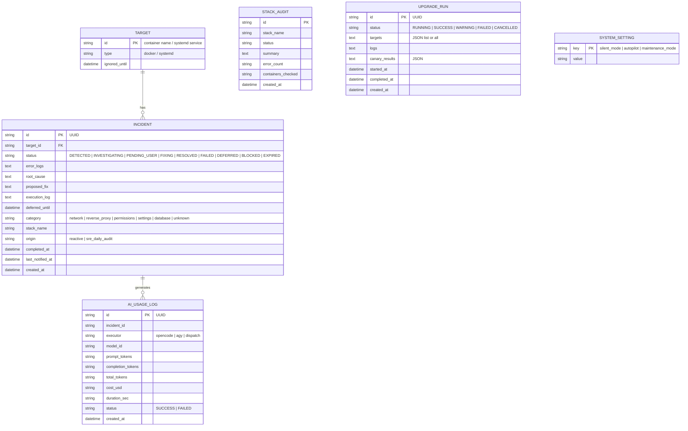
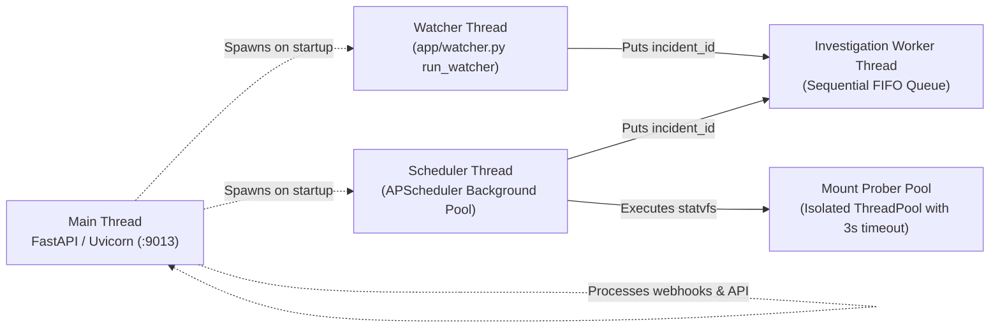

# System Architecture & Topology

MonitorBot is an autonomous homelab Site Reliability Engineering (SRE) agent designed to ensure zero-downtime operations, proactive error detection, and self-healing across Docker Compose stacks and host systemd services.

It operates natively on the host server (`10.0.0.10`) under a dedicated systemd service (`monitorbot.service`), running FastAPI on port `9013` paired with an integrated React + TypeScript Single Page Application (SPA) dashboard.

---

## High-Level Topology

The system integrates real-time kernel and Docker socket events, background cron schedules, vector semantic memory, a multi-tiered AI delegation gateway, and a resilient multi-channel notification mesh.

```mermaid
flowchart TB
    subgraph Host["Host Environment (10.0.0.10)"]
        DockerSock["Docker Daemon Socket\n(/var/run/docker.sock)"]
        Sysd["Systemd Manager\n(systemctl / journalctl)"]
        ProcMounts["Kernel Mount Table\n(/proc/mounts & statvfs)"]
        
        subgraph MonitorBotDaemon["MonitorBot Service (:9013)"]
            FastAPI["FastAPI Web Framework\n(app/main.py & routers)"]
            ReactSPA["React SPA Dashboard\n(frontend/dist served at /)"]
            Watcher["Docker Event Watcher\n(app/watcher.py)"]
            Scheduler["APScheduler Background Engine\n(app/scheduler.py)"]
            Investigator["AI Investigator & Queue\n(app/investigator.py)"]
            Remediator["Remediator Engine\n(app/remediator.py)"]
            Notifier["Fail-Safe Notifier\n(app/notifier.py)"]
            SREAuditor["SRE Stack Auditor\n(app/stack_watcher.py)"]
            StorageHealth["Storage & FUSE Auditor\n(app/system_health.py)"]
            UpgradeMgr["Canary Upgrade Manager\n(app/upgrades.py)"]
        end

        SQLite[("SQLite Database\n(monitorbot.db)")]
        Qdrant[("Qdrant Vector DB\n(qdrant_data/ - FastEmbed)")]
    end

    subgraph AIDelegation["AI Delegation Gateway"]
        CLIAgent["CLIAgentDispatch HTTP\n(:8032/v1/chat/completions)"]
        OpenCodeDaemon["OpenCode Serve Daemon\n(HTTP :4096 / CLI fallback)"]
        AGY["Antigravity CLI\n(agy subprocess fallback)"]
    end

    subgraph NotificationBus["Fail-Safe Notification Mesh"]
        NtfyPublic["Primary: Cloud ntfy\n(https://ntfy.wileyriley.com/alerts)"]
        NtfyLocal["Fallback: LAN ntfy Port\n(http://localhost:9010/alerts)"]
        SMTPServer["Fallback: Admin Email\n(SMTP SSL :465 / STARTTLS :587)"]
        Telegram["Telegram Bot API\n(Inline Action Buttons)"]
    end

    %% Internal Connections
    DockerSock -->|Container die / unhealthy| Watcher
    Sysd -->|Service status / logs| Scheduler
    ProcMounts -->|statvfs probes| StorageHealth
    
    Watcher -->|Create incident & tail logs| SQLite
    Scheduler -->|Cron triggers & retry checks| SREAuditor
    Scheduler -->|Proactive 10m probe| StorageHealth
    
    Watcher -->|Queue investigation| Investigator
    SREAuditor -->|Actionable SRE findings| SQLite
    StorageHealth -->|D-State mount hung| SQLite
    
    Investigator <-->|Query historical fixes & cosine search| Qdrant
    Investigator <-->|Read/Write incident status| SQLite
    Investigator -->|Tier 1: HTTP Dispatch| CLIAgent
    Investigator -->|Tier 2: Daemon HTTP| OpenCodeDaemon
    Investigator -->|Tier 3: CLI Subprocess| AGY
    
    Investigator -->|Trigger alert on PENDING_USER| Notifier
    Notifier -->|Push with Action Buttons| NtfyPublic
    NtfyPublic -.->|On failure/timeout| NtfyLocal
    NtfyLocal -.->|On failure/timeout| SMTPServer
    Notifier -->|Broadcast| Telegram
    
    FastAPI -->|Serve API & static assets| ReactSPA
    FastAPI -->|Handle action webhooks (/api/webhooks)| Remediator
    Remediator -->|Execute restart/compose/fix| DockerSock
    Remediator -->|Record successful vector fix| Qdrant
    UpgradeMgr -->|4-Phase Canary Verification| DockerSock
```

---

## Core Component Responsibilities

| Component | Source File | Key Responsibilities |
| :--- | :--- | :--- |
| **Docker Event Watcher** | `app/watcher.py` | Consumes non-polling Docker daemon event stream; filters benign exits (SIGTERM, code 0/143/130); suppresses cascading errors if Caddy is down; enforces sliding-window circuit breakers; captures recent log tails. |
| **Background Scheduler** | `app/scheduler.py` | Orchestrates recurring maintenance with APScheduler: evaluates deferred/ignored incidents every 60s; checks systemd unit health; triggers periodic heartbeats; runs daily SRE stack log audits; triggers storage mount probes every 10m. |
| **AI Investigator** | `app/investigator.py` | Manages sequential FIFO investigation queue; queries Qdrant for semantic historical fixes; synthesizes prompt adhering to homelab rules; dispatches to `CLIAgentDispatch` HTTP (`:8032`), with tiered failovers to OpenCode (`:4096`) and Antigravity (`agy`). |
| **Remediator Engine** | `app/remediator.py` | Executes approved fixes (Docker restart, Compose up, custom shell commands); verifies post-remediation container health; writes verified solutions into Qdrant vector memory for continuous learning. |
| **Fail-Safe Notifier** | `app/notifier.py` | Dispatches incident alerts with interactive HTTP action buttons (`Fix Now`, `Defer 24h`, `Ignore Target`); rewrites webhook URLs to local LAN IP (`http://10.0.0.10:9013`) when public proxy fails; falls back to direct SMTP email. |
| **SRE Stack Auditor** | `app/stack_watcher.py` | Scans 24-hour log streams across all compose stacks; filters known benign homelab noise via regex; uses LLM analysis to produce per-container actionable diagnoses; records `StackAudit` history. |
| **Storage & FUSE Auditor** | `app/system_health.py` | Discovers host and FUSE mounts (`rclone`, `mergerfs`, `nfs`); executes thread-isolated `statvfs` calls with strict 3-second timeouts; catches errno 110/hung mounts before kernel D-state deadlocks occur. |
| **Canary Upgrade Manager** | `app/upgrades.py` | Orchestrates safe host upgrades following the Pipeline Pattern: pulls images, updates containers, prunes unused layers, flushes Uptime Kuma DNS cache, and validates health via a 4-phase canary probe. |

---

## Database Architecture & Data Models

MonitorBot utilizes SQLite (`/containers/monitorbot/monitorbot.db`) accessed via SQLAlchemy ORM with thread-safe session factories.



### Model Specifications

#### 1. `Incident` (`app/database.py`)
Tracks every container crash, systemd failure, or SRE audit finding:
- **`status`**: State machine driving remediation:
  - `DETECTED`: Incident recognized, queued for root cause analysis.
  - `INVESTIGATING`: Prompt dispatched to AI Delegation Gateway.
  - `PENDING_USER`: Root cause identified, proposed fix waiting for human approval or autopilot timeout.
  - `FIXING`: Remediator actively executing commands.
  - `RESOLVED`: Target verified healthy after fix or self-recovery.
  - `FAILED`: Execution failed or container remained unhealthy.
  - `DEFERRED`: Alert snoozed for 24 hours.
  - `BLOCKED`: Tripped circuit breaker due to repeated failures (>= 2 in 60m).
  - `EXPIRED`: Unresponded incident older than 24 hours auto-closed.
- **`origin`**: Distinguishes `reactive` (Docker socket crash) from `sre_daily_audit` (proactive log scan).
- **`category`**: Categorized by AI (`network`, `reverse_proxy`, `permissions`, `settings`, `database`, `unknown`).

#### 2. `Target` (`app/database.py`)
Represents an observed entity (Docker container or systemd service unit):
- **`id`**: Unique identifier (e.g., `paperless-ngx`, `caddy`, `frigate`).
- **`type`**: `docker` or `systemd`.
- **`ignored_until`**: Timestamp until which alerts and automated actions are suppressed.

#### 3. `StackAudit` (`app/database.py`)
Maintains historical records of daily scheduled log reviews across compose stacks:
- **`stack_name`**: Name of the stack directory (e.g., `media_download`, `smarthome_core`).
- **`status`**: `HEALTHY`, `WARNING`, `ACTION_REQUIRED`, `DEGRADED`, or `FAILED`.
- **`error_count`** & **`containers_checked`**: Numeric metrics for observability.

#### 4. `UpgradeRun` (`app/database.py`)
Tracks full-stack autonomous upgrades and 4-phase canary audits:
- **`targets`**: Stacks included in the run.
- **`canary_results`**: Serialized JSON of all 4 canary checks (restarting containers, unhealthy containers, Caddyfile syntax validation, core HTTPS reachability).

#### 5. `AIUsageLog` (`app/database.py`)
Captures cost, token consumption, and response latency across all AI invocations, powering the usage analytics dashboard.

---

## Concurrency & Threading Model

MonitorBot employs a multi-threaded architecture within a single host process to maintain real-time responsiveness:



1. **Main Process & Async Loop**: Serves REST API routes and static React assets with low-latency async handlers.
2. **Dedicated Watcher Daemon**: Blocks on the raw Docker event stream socket, reacting to container lifecycle events in under 50 milliseconds.
3. **Sequential AI Investigation Queue**: Ensures AI model requests are executed one-at-a-time (`investigation_queue = queue.Queue()`), preventing model concurrency thrashing and rate-limit exhaustion.
4. **Thread-Isolated Storage Probes**: Runs `os.statvfs` inside an explicit `ThreadPoolExecutor(max_workers=1)` with strict 3-second timeouts. If a remote NFS share or rclone FUSE mount hangs in the kernel, the thread is abandoned without blocking the scheduler or daemon.
