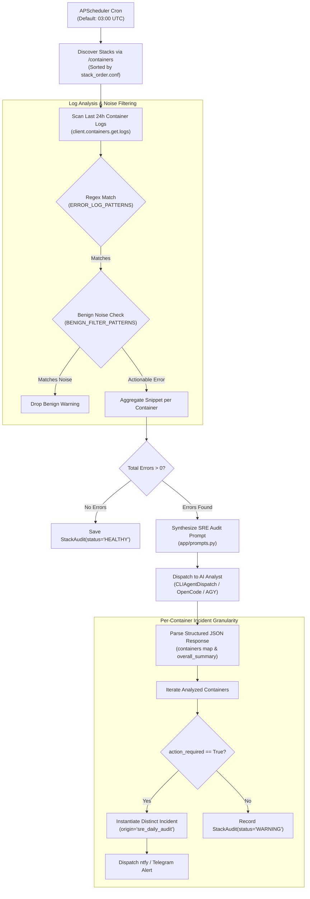
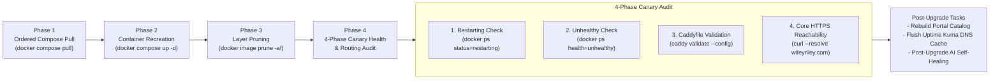

# SRE Stack Auditor & Canary Upgrades

While the [Event Watcher](/architecture/event-watcher) reacts to container termination and unhealthy status events in real time, many severe production issues do not crash the container immediately. 

Stealth degradation—such as database connection pool exhaustion, memory overcommit thrashing, recurring authentication failures, or corrupted FUSE mounts—often lurks in container log streams for hours.

The **SRE Stack Auditor** (`app/stack_watcher.py`), **Background Scheduler** (`app/scheduler.py`), and **Canary Upgrade Manager** (`app/upgrades.py`) provide proactive, automated inspection across all Docker Compose stacks and host storage systems.

---

## Architecture & Daily Audit Flow

Every day at `03:00 UTC` (configurable via `SRE_AUDIT_CRON_HOUR` and `SRE_AUDIT_CRON_MINUTE`), the background scheduler triggers a deep audit across all discovered stacks.



---

## 1. 24-Hour Container Log Scanning & Noise Suppression

The SRE auditor connects to Docker and pulls logs generated over the last 24 hours (`since=datetime.utcnow() - timedelta(hours=24)`) for every container in the stack.

### Error Pattern Detection
```python
ERROR_LOG_PATTERNS = re.compile(
    r"(?i)\b(error|fatal|panic|exception|traceback|critical|fail|failed|unhandled|refused|warn|warning)\b"
)
```

### Benign Homelab Noise Filtering
Homelab environments run diverse services that frequently log non-critical warnings during idle periods. MonitorBot applies an allowlist of benign patterns (`BENIGN_FILTER_PATTERNS`) to eliminate alerting fatigue:

- **Deprecation notices**: `node --trace-deprecation`, MySQL legacy auth notices.
- **Transient reconnection drops**: SSE connection drops, temporary upstream timeouts (`Plex HTTPSConnectionPool Read timed out`).
- **Unauthenticated public telemetry**: Qdrant telemetry report failures, HuggingFace Hub unauthenticated notices.
- **Normal CLI output formatting**: Test tables and checkmark legends (`Legend: ✓ ok · ~ partial · ✗ failed · -- skipped`).

---

## 2. Per-Container Incident Granularity

Earlier monitoring solutions created a single, monolithic incident for an entire Docker Compose stack whenever any error occurred. This caused severe ambiguity: an issue in a secondary utility container (e.g., a backup sidecar) would mask critical database issues in the primary container.

MonitorBot resolves this by requiring the AI SRE Analyst to return a **per-container JSON contract**:

```json
{
  "overall_summary": "Stack 'media_download' shows a database lock error on qbittorrent-exporter while gluetun is healthy.",
  "containers": {
    "qbittorrent-exporter": {
      "action_required": true,
      "root_cause": "Prometheus exporter timed out querying qBittorrent WebUI due to credentials mismatch.",
      "proposed_fix": "Update QBITTORRENT_PASSWORD environment variable in docker-compose.yaml.",
      "category": "settings"
    },
    "gluetun": {
      "action_required": false,
      "root_cause": "Minor transient WireGuard handshake retry logged during WAN IP refresh.",
      "proposed_fix": "",
      "category": "network"
    }
  }
}
```

### Discrete Incident Generation:
For every container where `action_required == true`:
1. Ensures the target container exists in `Target` table.
2. Instantiates a dedicated `Incident` record:
   - `target_id`: Exact container name (`qbittorrent-exporter`).
   - `stack_name`: Parent stack (`media_download`).
   - `origin`: Marked as `sre_daily_audit`.
   - `status`: Set to `PENDING_USER`.
   - `error_logs`: Contains only that specific container's isolated error snippet.
3. Records comprehensive transcript events (`PROMPT_GENERATED`, `AI_THINKING_RAW`, `DIAGNOSIS_PARSED`).
4. Dispatches actionable push notifications with direct remediation buttons.

---

## 3. Canary Stack Upgrades (`app/upgrades.py`)

MonitorBot provides fully autonomous stack upgrades that replace standard, risky `docker compose pull && docker compose up -d` shell routines with verified canary audits.

### Upgrade Pipeline Phases



### The 4 Canary Health Checks

1. **Restarting Containers Check**:
   Executes:
   ```bash
   docker ps --filter status=restarting --format '{{.Names}}'
   ```
   Any container caught in a crashloop immediately fails the upgrade run.
2. **Unhealthy Containers Check**:
   Executes:
   ```bash
   docker ps --filter health=unhealthy --format '{{.Names}}'
   ```
   Containers failing Docker healthchecks are flagged before user traffic is impacted.
3. **Caddyfile Validation**:
   Executes `docker compose -f /containers/webservices/docker-compose.yaml exec -T caddy caddy validate --config /etc/caddy/Caddyfile`. Prevents unformatted or syntactically broken reverse proxy configurations from persisting.
4. **Core HTTPS Reachability**:
   Executes an empirical TLS handshake check against the primary portal:
   ```bash
   curl -s -o /dev/null -w "%{http_code}" -k --resolve wileyriley.com:443:10.0.0.10 https://wileyriley.com
   ```
   Ensures local DNS and Caddy reverse proxy routing respond cleanly with HTTP 200/302.

### Post-Upgrade Housekeeping
- **Portal Catalog Indexing**: Runs `portal_cli.py build` and `generate_catalog.py` to keep the homelab service dashboard synchronized with new containers.
- **Uptime Kuma DNS Cache Flush**: Restarts `uptime-kuma` and `autokuma` containers to flush internal Node.js DNS caching and eliminate false `ECONNREFUSED` errors on newly assigned internal container IPs.
- **Post-Upgrade AI Self-Healing Hook**: If any canary check fails, the upgrade manager automatically queues an incident for the failing container, triggering the AI Investigator to diagnose the upgrade failure.

---

## 4. Storage & FUSE Mount Health Auditor (`app/system_health.py`)

Cloud mounts (such as `rclone` Google Drive / OneDrive mounts, `mergerfs` pools, or remote `NFS` shares) are prone to kernel deadlocks if network connectivity drops or the remote API times out. 

Standard file checks like `os.path.exists()` or `ls` will block indefinitely in uninterruptible sleep (**kernel D-state**), freezing entire monitoring daemons and requiring a hard host reboot.

### Thread-Isolated Probe with Strict Timeout:
```python
def probe_mount(mount_path: str, timeout: float = 3.0) -> Dict[str, Any]:
    def _do_stat() -> Dict[str, Any]:
        stat = os.statvfs(mount_path)
        total_bytes = stat.f_blocks * stat.f_frsize
        free_bytes = stat.f_bavail * stat.f_frsize
        used_bytes = total_bytes - (stat.f_bfree * stat.f_frsize)
        usage_pct = (used_bytes / total_bytes * 100.0) if total_bytes > 0 else 0.0
        return {
            "path": mount_path,
            "healthy": True,
            "usage_percent": round(usage_pct, 2),
            "error": None
        }

    executor = concurrent.futures.ThreadPoolExecutor(max_workers=1)
    future = executor.submit(_do_stat)
    try:
        res = future.result(timeout=timeout)
        executor.shutdown(wait=False)
        return res
    except (concurrent.futures.TimeoutError, TimeoutError):
        executor.shutdown(wait=False)
        return {
            "path": mount_path,
            "healthy": False,
            "errno": 110,
            "error": f"Probe timed out after {timeout}s (unresponsive/hung mount)"
        }
```

- **Execution**: The background scheduler audits all storage and FUSE mounts every 10 minutes.
- **Isolation**: If a mount hangs, the future times out after 3.0 seconds, returning `errno: 110` (Connection timed out). The hung thread is abandoned without stalling the daemon.
- **Remediation**: MonitorBot creates an `Incident` for the wedged mount point, alerting the administrator to unmount (`fusermount -uz <path>`) or restart the corresponding mount service before downstream containers fail.
