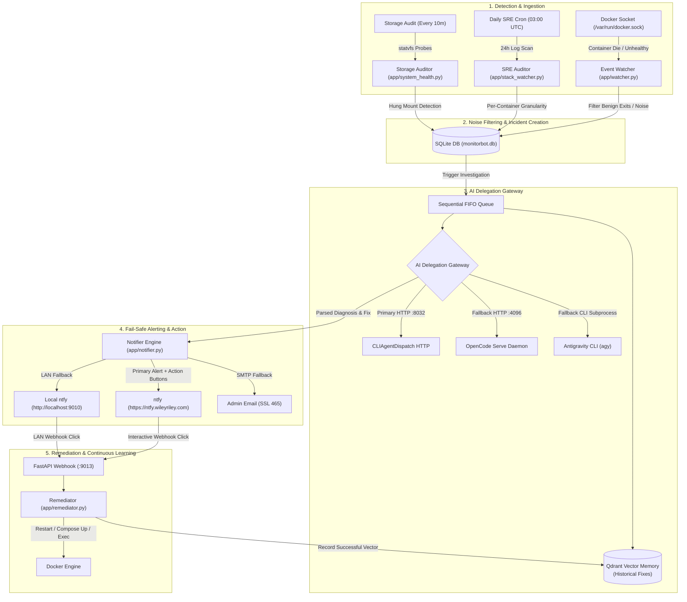

## System Workflow & Lifecycle

MonitorBot orchestrates an autonomous feedback loop connecting real-time Docker engine events, scheduled SRE log auditing, AI-powered root cause analysis, and human-in-the-loop remediation.

## Core Architecture Matrix

| Capability | Component | Primary Mechanism | Fallback / Redundancy |
| :--- | :--- | :--- | :--- |
| **Reactive Crash Detection** | `app/watcher.py` | Sub-second Docker event stream listener | Circuit breaker (60m window, >=2 fails) |
| **Scheduled Log Auditing** | `app/stack_watcher.py` | 24-hour log scan across all compose stacks | Benign homelab regex filter |
| **AI Investigation** | `app/investigator.py` | `CLIAgentDispatch` HTTP (`:8032/v1`) | OpenCode daemon (`:4096`) & Antigravity `agy` CLI |
| **Memory & Learning** | `app/qdrant_mem.py` | Qdrant vector semantic search (`FastEmbed`) | Direct rule-based prompt synthesis |
| **Alert Dispatch** | `app/notifier.py` | Cloud ntfy with actionable HTTP buttons | Local LAN port (`:9010`) & SMTP TLS email |
| **Storage & Mount Health** | `app/system_health.py` | Thread-isolated `statvfs` with 3s timeout | Kernel D-state hang isolation |
| **Stack Upgrades** | `app/upgrades.py` | Ordered compose pull, recreate, prune | 4-Phase Canary Health & Routing Audit |
| **MCP Integration** | `app/routers/` | FastMCP SSE server for Model Context Gateway | REST API (`/api/incidents`, `/api/stacks`) |

## Quick Navigation

- **[System Architecture Overview](/architecture/overview)**: Deep dive into the process topology, SQLite schema, thread model, and runtime boundaries.
- **[Docker Event Watcher](/architecture/event-watcher)**: Real-time container event handling, debouncing, intelligent noise suppression, and circuit breakers.
- **[SRE Stack Auditor](/architecture/sre-auditor)**: Daily log audits, error burst detection, per-container incident granularity, and canary upgrades.
- **[AI Delegation Gateway](/ai/agent-dispatch)**: CLIAgentDispatch HTTP, OpenCode daemon, Antigravity CLI failover, and token telemetry.
- **[Fail-Safe Notifications](/reliability/notifications)**: Actionable ntfy buttons, local LAN IP rewrites, and immediate SMTP email fallbacks.
