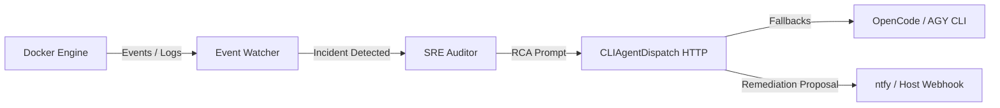

## Overview Workflow

```mermaid
flowchart LR
    Docker[Docker Engine] -->|Events / Logs| Watcher[Event Watcher]
    Watcher -->|Incident Detected| Auditor[SRE Auditor]
    Auditor -->|RCA Prompt| Dispatch[CLIAgentDispatch HTTP]
    Dispatch -->|Fallbacks| CLI[OpenCode / AGY CLI]
    Dispatch -->|Remediation Proposal| Notifier[ntfy / Host Webhook]
```
