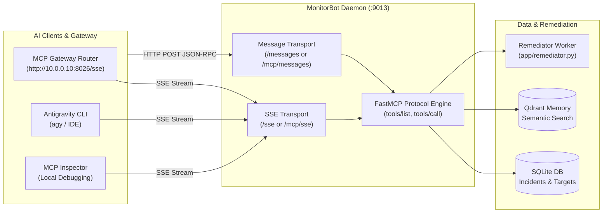

# FastMCP Server & Homelab Tool Integration

MonitorBot embeds a native **Model Context Protocol (MCP)** server over Server-Sent Events (SSE). This allows external LLM orchestrators, AI coding agents (such as Antigravity, OpenCode, Claude Code, and Cursor), and the centralized **Model Context Gateway (MCG)** to inspect incidents, query institutional memory, and trigger remediation actions directly via standardized tool calling.

---

## Server Architecture & Endpoints

The MCP server is implemented using the Python `mcp` SDK (`Server("monitorbot-mcp")` and `SseServerTransport`) mounted directly into the FastAPI application lifecycle (`app/main.py`).



### Protocol Endpoints

To maintain compatibility with various reverse proxies and gateway conventions, MonitorBot exposes dual paths:

| Endpoint | HTTP Method | Description |
| :--- | :--- | :--- |
| `/sse` or `/mcp/sse` | `GET` | Establishes the persistent Server-Sent Events (SSE) stream for client session negotiation. |
| `/messages` or `/mcp/messages` | `POST` | Receives JSON-RPC 2.0 messages from the client during an active SSE session. |

---

## Model Context Gateway (MCG) Registration

The homelab runs a centralized Model Context Gateway router at `http://10.0.0.10:8026/sse`. MonitorBot registers as a backend service within the MCG cluster.

### Gateway Client Configuration (`mcpServers` format)
To connect directly to MonitorBot from an external agent or desktop client:
```json
{
  "mcpServers": {
    "monitorbot": {
      "url": "http://10.0.0.10:9013/sse"
    }
  }
}
```

---

## Exposed Tool Definitions

MonitorBot exposes three specialized tools for incident triage and autonomous operations:

### 1. `search_incidents`
Performs vector semantic similarity search across past resolved incidents using Qdrant memory to find verified solutions for similar error signatures.

#### Input Schema
```json
{
  "type": "object",
  "properties": {
    "query": {
      "type": "string",
      "description": "The search query (e.g. permission error, network timeout, database connection refused)"
    },
    "limit": {
      "type": "integer",
      "description": "Max number of incidents to return.",
      "default": 5
    }
  },
  "required": ["query"]
}
```

#### Return Value
Text block containing matched incident IDs, container names, similarity scores, diagnosed root causes, and verified fix commands.

---

### 2. `get_incident_history`
Retrieves the chronological audit history of crashes, failures, and remediations for a specific container target.

#### Input Schema
```json
{
  "type": "object",
  "properties": {
    "target_id": {
      "type": "string",
      "description": "Name of the target Docker container (e.g. 'paperless-ngx', 'caddy')."
    },
    "limit": {
      "type": "integer",
      "description": "Max history size.",
      "default": 10
    }
  },
  "required": ["target_id"]
}
```

#### Return Value
Formatted list of incident records containing timestamps, operational statuses (`RESOLVED`, `FAILED`, `BLOCKED`), root causes, and applied fixes.

---

### 3. `trigger_remediation`
Approves and initiates automated remediation for an incident waiting in `PENDING_USER` status.

#### Input Schema
```json
{
  "type": "object",
  "properties": {
    "incident_id": {
      "type": "string",
      "description": "UUID of the active incident."
    }
  },
  "required": ["incident_id"]
}
```

#### Return Value
Confirmation string indicating that the background remediation worker was spawned and the container is transitioning to `FIXING`.

---

## Testing with MCP Inspector

You can interactively test and debug MonitorBot's MCP endpoints using the official `@modelcontextprotocol/inspector`:

```bash
# Launch MCP Inspector pointing to MonitorBot's local SSE endpoint
npx @modelcontextprotocol/inspector http://localhost:9013/sse
```

### Inspection Steps:
1. Open the Inspector browser UI (typically at `http://localhost:5173`).
2. Verify that `search_incidents`, `get_incident_history`, and `trigger_remediation` appear under **Tools**.
3. Execute `search_incidents` with query `"connection refused"` to inspect real-time vector retrieval.
