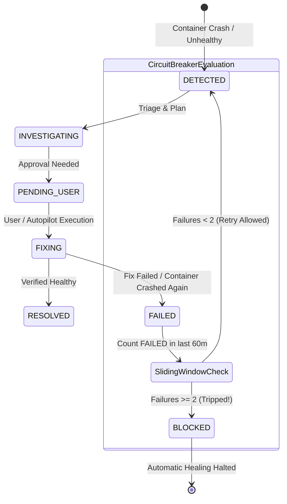
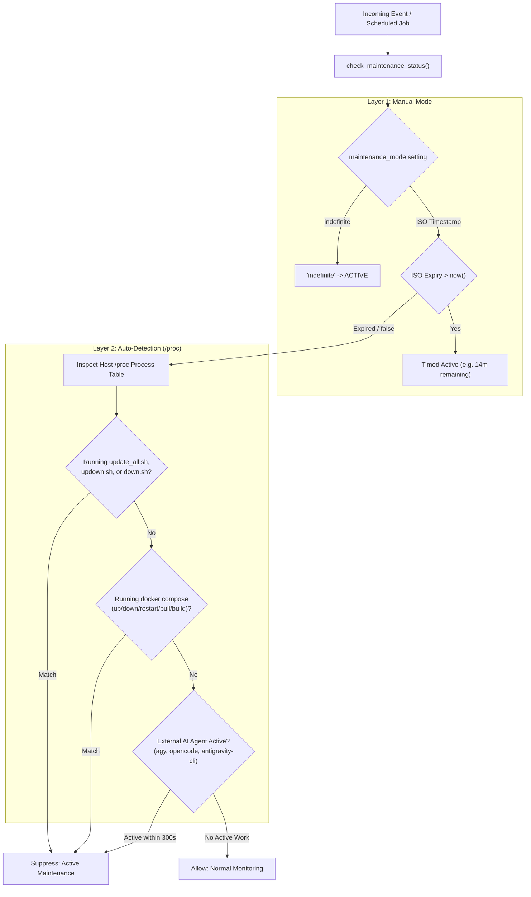

# Circuit Breakers & Maintenance Mode Suppression

Automated self-healing systems must possess strict feedback boundaries. Without safeguards, an automated bot responding to a database schema corruption or invalid container environment variable can enter an infinite restart-fail loop, consuming cloud API tokens, degrading disk lifespan, and spamming administrators.

MonitorBot implements a dual-layer defense: **sliding-window circuit breakers** for rogue containers, and **intelligent maintenance mode suppression** that detects active system administration or AI coding agents.

---

## 1. Sliding-Window Circuit Breakers

The circuit breaker monitors failure frequency for every registered target (Docker containers, systemd services, and storage mounts).



### Sliding-Window Evaluation Logic

Before queueing an investigation or allowing remediation, `app/watcher.py` queries SQLite for failures within a 60-minute sliding window:

```python
one_hour_ago = datetime.utcnow() - timedelta(minutes=60)
recent_failures = db.query(Incident).filter(
    Incident.target_id == container_name,
    Incident.status == "FAILED",
    Incident.completed_at >= one_hour_ago
).count()

if recent_failures >= 2:
    logger.warning(
        f"Circuit breaker tripped for target '{container_name}': "
        f"{recent_failures} failures in 60 minutes."
    )
    new_incident = Incident(
        id=str(uuid.uuid4()),
        target_id=container_name,
        status="BLOCKED",
        error_logs=(
            f"Circuit breaker tripped: {recent_failures} failures in 60m. "
            "Automatic recovery disabled."
        ),
        created_at=datetime.utcnow(),
        completed_at=datetime.utcnow()
    )
    db.add(new_incident)
    db.commit()

    send_incident_notification(new_incident.id)
    return
```

### `BLOCKED` State Semantics
When tripped:
1. **Remediation Frozen**: All automated AI analysis and self-healing actions for that target are completely suppressed.
2. **Emergency Notification**: Dispatches an alert with priority `max` and tag `no_entry`.
3. **Admin Intervention Required**: The target remains in `BLOCKED` status until an administrator manually resets the incident or unignores the target via the dashboard.

---

## 2. Maintenance Mode Suppression

When an administrator or external AI coding agent is actively building, pulling, or restarting stacks, containers will naturally transition through `die`, `stop`, and temporary `unhealthy` states. Treating these intentional operations as outages causes extreme false alarm fatigue.

`check_maintenance_status()` in `app/database.py` acts as a global gatekeeper across the Docker event watcher, scheduler, SRE log auditor, and storage health probes.



---

## Auto-Maintenance Detection via Host `/proc` Inspection

MonitorBot scans `/proc` on the Linux host to detect active management operations in real time without requiring explicit user toggles.

### 1. Host Lifecycle Scripts
Detects running shell maintenance scripts:
```python
for script in ["update_all.sh", "updown.sh", "down.sh"]:
    if script in cmd_lower:
        return True, f"Active update script: '{cmd}'"
```

### 2. Modifying Docker Compose Commands
Detects interactive compose commands modifying container state:
```python
if "docker compose" in cmd_lower or "docker-compose" in cmd_lower:
    modifying_kws = ["up", "down", "stop", "restart", "pull", "build", "rm", "create"]
    tokens = cmd_lower.split()
    if any(kw in tokens for kw in modifying_kws):
        return True, f"Active docker compose: '{cmd}'"
```

### 3. Active External AI Coding Agents
Homelab coding agents like Antigravity (`agy`) or OpenCode (`opencode`) frequently bounce containers during development tasks. MonitorBot inspects active agent processes:
- **Child Process Filtering**: Ensures MonitorBot does not detect its own child investigation subprocesses:
  ```python
  def is_descendant_of_monitorbot(pid: int) -> bool: ...
  ```
- **5-Minute Quiescence Window**: Inspects recent agent disk activity or command invocation within the last 300 seconds:
  ```python
  if "agy" in cmd_lower or "antigravity-cli" in cmd_lower or "opencode" in cmd_lower:
      if not is_descendant_of_monitorbot(pid) and pid != my_pid:
          if (time.time() - cached_agent_ts) < 300:
              return True, f"Active AI coding agent (PID {pid}): '{cmd}'"
  ```

---

## Maintenance Suppression Behaviors

When `check_maintenance_status()` returns `True`, MonitorBot enforces complete suppression:

| Subsystem | File | Behavior During Maintenance |
| :--- | :--- | :--- |
| **Docker Event Watcher** | `app/watcher.py` | Drops all `die` and `unhealthy` events without creating database records. |
| **Background Scheduler** | `app/scheduler.py` | Pauses 60-second health auto-resolution checks and suppresses deferred incident retries. |
| **SRE Stack Auditor** | `app/scheduler.py` | Skips daily 24-hour log audits to prevent false positives while stacks are mid-deployment. |
| **Storage & Mount Auditor**| `app/scheduler.py` | Skips proactive 10-minute mount probing while disk configurations are being modified. |
| **Web Dashboard** | React SPA / Jinja2 | Displays an amber warning banner with live countdown timer and active reason string. |

---

## Managing Maintenance Mode via CLI & REST

### CLI Commands (`cli.py`)
```bash
# Check current status
python3 cli.py status

# Pause monitoring for a fixed duration
python3 cli.py pause 30m
python3 cli.py pause 2h

# Pause monitoring indefinitely
python3 cli.py pause indefinite

# Resume monitoring immediately
python3 cli.py resume
```

### REST API (`/api/maintenance`)
```http
POST /api/maintenance HTTP/1.1
Content-Type: application/json

{
  "duration": "1h"
}
```
*Supported values*: `"15m"`, `"30m"`, `"1h"`, `"2h"`, `"12h"`, `"indefinite"`, `"resume"`.
