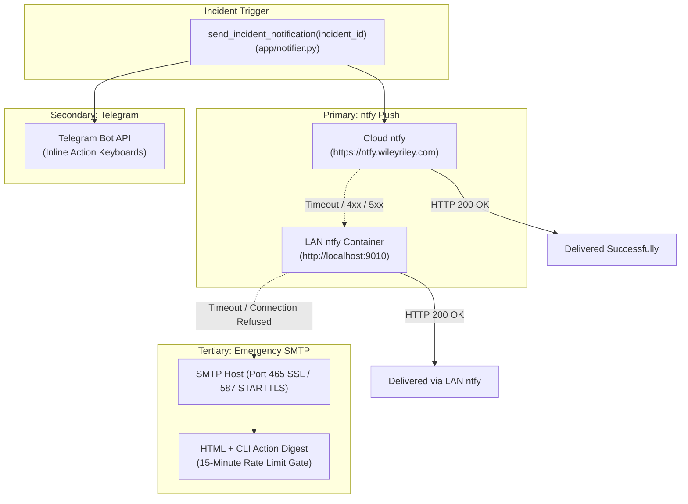
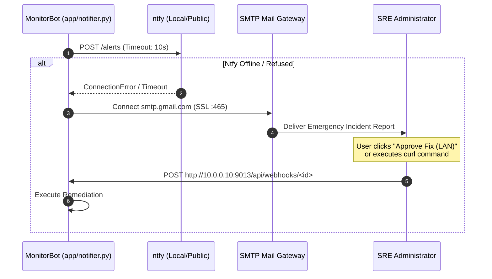

# Resilient Notifications & Multi-Channel Fallback

MonitorBot is designed to operate reliably during severe infrastructure outages. If the reverse proxy crashes, public DNS fails, or internet connectivity is severed, alerts must still reach human administrators, and interactive buttons must remain clickable over the local network. 

To achieve this, `app/notifier.py` implements a tiered, fail-safe notification mesh spanning **ntfy**, **Telegram**, and direct **SMTP Email**.

---

## Multi-Channel Notification Mesh



---

## ntfy Interactive Action Buttons

MonitorBot equips incident notifications with HTTP action buttons allowing one-tap remediation directly from phone lockscreens, smartwatches, or browser popups.

### Header Specification & Syntax
The `Actions` HTTP header conforms to ntfy's multi-action specification:
```http
Actions: http, Fix Now, https://monitorbot.wileyriley.com/api/webhooks/<id>?token=<tok>, method=POST, headers.Content-Type=application/json, body={\"action\": \"fix\"}; http, Defer 24h, https://monitorbot.wileyriley.com/api/webhooks/<id>?token=<tok>, method=POST, headers.Content-Type=application/json, body={\"action\": \"defer\"}; http, Ignore Target, https://monitorbot.wileyriley.com/api/webhooks/<id>?token=<tok>, method=POST, headers.Content-Type=application/json, body={\"action\": \"ignore\"}
```

### Action Capabilities

| Button Label | Action Payload | Engine Response |
| :--- | :--- | :--- |
| **Fix Now** | `{"action": "fix"}` | Transitions incident to `FIXING`, executes AI proposed command in background worker, and dispatches follow-up notification. |
| **Defer 24h** | `{"action": "defer"}` | Sets `deferred_until = now() + 24h` and updates status to `DEFERRED`. Snoozes all alerts for 24 hours. |
| **Ignore Target** | `{"action": "ignore"}` | Sets `target.ignored_until = 9999-12-31` and updates status to `IGNORED`. Permanently suppresses alerts until manually unignored. |

---

## Local LAN IP Rewriting & Domain Unreachability Fallback

When Caddy reverse proxy fails, internal Docker networking breaks, or external ISP connectivity drops, external URLs (`https://ntfy.wileyriley.com` and `https://monitorbot.wileyriley.com`) fail to resolve.

### Automatic Fallback Sequence:
1. **Primary Public Attempt**:
   MonitorBot posts to `NTFY_URL` (`https://ntfy.wileyriley.com/alerts`).
2. **Detection of Failure**:
   If the request times out (> 10s) or returns an HTTP connection error, MonitorBot initiates local failover.
3. **Local LAN ntfy Fallback**:
   MonitorBot retries by posting directly to the host-mapped port for the local ntfy container:
   ```text
   http://localhost:9010/alerts
   ```
4. **URL Rewriting to LAN Base**:
   Crucially, the webhook endpoints inside the action buttons are dynamically rewritten from the public domain to `LOCAL_WEBHOOK_BASE_URL` (`http://10.0.0.10:9013`):
   ```text
   http, Fix Now, http://10.0.0.10:9013/api/webhooks/<id>?token=<tok>, method=POST, headers.Content-Type=application/json, body={\"action\": \"fix\"}
   ```
   This ensures that an administrator connected to home Wi-Fi or WireGuard VPN can still click "Fix Now" and restore service even if all public web routing is offline.

---

## Emergency SMTP Email Fallback

If both public and local ntfy endpoints fail, MonitorBot escalates to emergency SMTP email delivery.

### Dual-Protocol SSL / STARTTLS
`send_email_notification()` automatically negotiates encryption:
- **Port 465**: Connects using native `smtplib.SMTP_SSL`.
- **Port 587**: Connects via `smtplib.SMTP` and initiates `STARTTLS`. If `STARTTLS` fails, it automatically falls back to port 465 SSL.

### High-Fidelity HTML & Terminal Email Body
The email delivers a responsive dark-mode report containing:
1. Formatted root cause and proposed fix code blocks.
2. Dual action buttons linking to both **Public** and **Local LAN** webhooks.
3. A pre-formatted `curl` command for direct execution in an SSH terminal:
   ```bash
   curl -X POST "http://10.0.0.10:9013/api/webhooks/<id>?token=<tok>" \
     -H "Content-Type: application/json" \
     -d '{"action": "fix"}'
   ```



---

## Email Rate Limiting & Digest Window

During catastrophic cascading failures (such as a total power loss or dead network switch), dozens of containers may fail simultaneously. To prevent saturating the administrator's email inbox with hundreds of duplicate messages, MonitorBot enforces strict rate limiting:

```python
# Rate Limiting / Batching for Email Notifications:
# If an email fallback was sent in the last 15 minutes, skip individual emails for cascading failures.
global _last_email_sent_time
now = datetime.utcnow()
if _last_email_sent_time and (now - _last_email_sent_time).total_seconds() < 900:
    logger.info(f"Skipping individual email for incident {incident_id} (email rate limit active: max 1 digest per 15m).")
    return
```

- **Sliding Window**: Maximum 1 email per **15 minutes** (900 seconds).
- **Subsequent Failures**: Logged to disk and accessible via dashboard and CLI while rate-limiting is active.

---

## Telegram Bot Integration

In addition to ntfy, MonitorBot broadcasts alerts to a configured Telegram chat using the Telegram Bot API (`send_telegram_notification()`):
- **Formatting**: HTML mode with strict character escaping (`html.escape`).
- **Inline Keyboards**:
  ```json
  {
    "inline_keyboard": [
      [
        {"text": "🛠️ Fix Now", "callback_data": "fix:<incident_id>"},
        {"text": "⏳ Defer 24h", "callback_data": "defer:<incident_id>"},
        {"text": "🚫 Ignore 24h", "callback_data": "ignore:<incident_id>"}
      ]
    ]
  }
  ```
- **Interactive Daemon**: `app/telegram_bot.py` runs a background polling loop processing button callback queries and executing remediations asynchronously.
