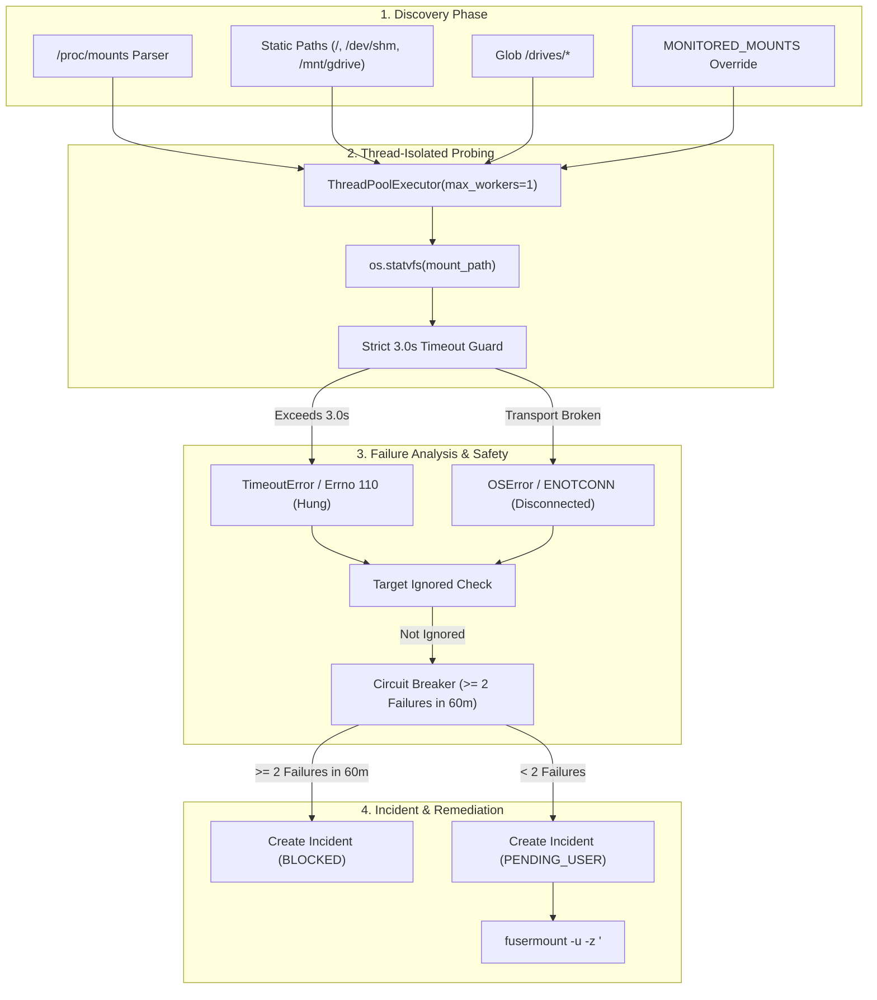

# Proactive Storage & FUSE Mount Auditor

Homelab environments frequently depend on remote storage backends, including network shares (NFS, SMB/CIFS), cloud drives (rclone), and pooled filesystems (mergerfs). When network interruptions occur or remote tokens expire, these FUSE filesystems often freeze into an unresponsive kernel **Uninterruptible Sleep (D-state)**. Standard system calls like `df`, `ls`, or `stat` then hang indefinitely, eventually causing system-wide thread exhaustion.

MonitorBot's Storage & FUSE Auditor (`app/system_health.py`) proactively inspects all storage drives and mounts using thread-isolated timeouts, detecting hung filesystems and initiating cleanup before the kernel deadlocks.

---

## Storage Auditing Architecture



---

## Dynamic Mount Discovery

`get_monitored_mounts()` aggregates all host filesystems requiring surveillance:

1. **Environment Configuration**: If `MONITORED_MOUNTS` is defined in `.env` (comma-separated), it overrides discovery.
2. **Kernel Mount Table (`/proc/mounts`)**:
   - Parses active mounts, automatically identifying network and FUSE types: `fuse`, `fuseblk`, `rclone`, `mergerfs`, `nfs`, and `cifs`.
   - Filters out virtual pseudo-filesystems: `/proc`, `/sys`, `/run/user`.
3. **Canonical Filesystem Paths**:
   - Explicitly monitors root (`/`), shared memory (`/dev/shm`), application caches (`/tmp/cache`), and cloud mounts (`/mnt/gdrive`).
4. **Drive Pools**:
   - Automatically globs and registers all drives mounted under `/drives/*`.

---

## Thread-Isolated Probing & 3-Second Timeout Guard

Under Linux, executing `os.statvfs()` on a hung FUSE filesystem puts the calling thread into a permanent D-state, immune even to `kill -9`. 

To protect the main FastAPI process and scheduler, `probe_mount()` isolates every probe within a dedicated single-worker thread pool with a strict 3-second deadline:

```python
def probe_mount(mount_path: str, timeout: float = 3.0) -> Dict[str, Any]:
    def _do_stat() -> Dict[str, Any]:
        stat = os.statvfs(mount_path)
        total_bytes = stat.f_blocks * stat.f_frsize
        free_bytes = stat.f_bavail * stat.f_frsize
        used_bytes = total_bytes - (stat.f_bfree * stat.f_frsize)
        usage_pct = (used_bytes / total_bytes * 100.0) if total_bytes > 0 else 0.0
        return {
            "path": mount_path,
            "healthy": True,
            "total_bytes": total_bytes,
            "free_bytes": free_bytes,
            "used_bytes": used_bytes,
            "usage_percent": round(usage_pct, 2),
            "error": None,
            "errno": None,
        }

    executor = concurrent.futures.ThreadPoolExecutor(max_workers=1)
    future = executor.submit(_do_stat)
    try:
        res = future.result(timeout=timeout)
        executor.shutdown(wait=False)
        return res
    except (concurrent.futures.TimeoutError, TimeoutError):
        executor.shutdown(wait=False)
        return {
            "path": mount_path,
            "healthy": False,
            "errno": 110,
            "error": f"Probe timed out after {timeout}s (unresponsive/hung mount)",
            "usage_percent": None,
        }
```

### Key Safety Guarantees:
- **`executor.shutdown(wait=False)`**: If `statvfs` hangs, the future times out, the executor is abandoned without waiting, and execution continues immediately.
- **Kernel Deadlock Prevention**: The MonitorBot scheduler never blocks waiting for a frozen NFS or rclone remote.

---

## Error Classification & Incident Creation

When a mount fails its probe, `audit_storage_and_mounts()` registers an incident under the target pattern `mount:<path>` (e.g., `mount:/mnt/gdrive`):

### Common Error Codes

| Errno | System Error | Typical Root Cause |
| :--- | :--- | :--- |
| **`110`** | `ETIMEDOUT` / Hung | Rclone or NFS connection dropped silently; remote server unresponsive. |
| **`107`** | `ENOTCONN` | Transport endpoint is not connected; FUSE daemon crashed. |
| **`5`** | `EIO` | Physical I/O error on disk or drive disconnected. |
| **`13`** | `EACCES` | Permission denied accessing mount point. |

### Generated Remediation Command
For hung or disconnected FUSE mounts, MonitorBot generates safe lazy-unmount commands:
```bash
fusermount -u -z '/mnt/gdrive' || umount -l '/mnt/gdrive'
# Remount or restart provider service if applicable
# systemctl restart rclone || docker compose restart
```
- **`-u -z` (Lazy unmount)**: Detaches the filesystem immediately from the directory tree, allowing running processes to close open file handles gracefully.

---

## Circuit Breakers & Mount Target Suppression

To avoid repetitive notification loops when a remote storage provider has extended downtime:
1. **Target Ignore Check**: If an administrator sets `target.ignored_until` (e.g., via the "Ignore Target" action button), future failures on that mount point are silently skipped.
2. **Circuit Breaker Evaluation**: If a mount records $\ge 2$ failed incidents within the last 60 minutes, the incident is placed into `BLOCKED` status, automated recovery is halted, and an emergency alert is triggered.

---

## Host RAM & Swap Utilization Auditing

Alongside disk mounts, `check_system_resources()` reads `/proc/meminfo` to detect memory leaks and swap thrashing before the Linux Out-Of-Memory (OOM) killer terminates containers:

| Resource Metric | Warning Threshold | Action |
| :--- | :--- | :--- |
| **RAM Usage** | `> 95.0%` | Flagged as degraded in health endpoint; warning logged. |
| **Swap Usage** | `> 90.0%` | Indicates severe host memory pressure and thrashing. |

Metrics are exposed via the dashboard and API for unified host telemetry.
