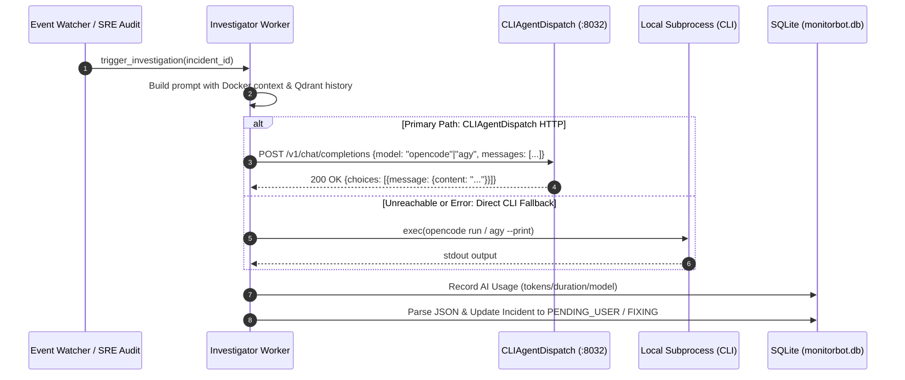

# Technical Design Specification: CLIAgentDispatch HTTP Integration & VitePress Documentation

- **Author**: Antigravity Agent & Steven T. Pelech
- **Date**: 2026-09-17
- **Target Repository**: `/containers/monitorbot` (`spelech/823SCD-Dockers` & `spelech/homelab-monitor-bot`)
- **Status**: Approved

---

## 1. Overview & Objectives

This specification outlines two major architectural enhancements for **MonitorBot**:
1. **CLIAgentDispatch HTTP Bridge Integration**: Refactor MonitorBot's AI investigation engine (`app/investigator.py`) to dispatch root-cause analysis and remediation prompts via standard OpenAI-compatible HTTP requests (`POST http://localhost:8032/v1/chat/completions`) served by the host's `cli-agent-dispatch.service`. Direct local CLI subprocess execution (`opencode run`, `agy`) is preserved as a resilient fallback.
2. **VitePress Documentation Suite**: Establish an interactive, searchable documentation site housed in `monitorbot/docs/` with Mermaid diagram support (`vitepress-plugin-mermaid`), documenting the full autonomous SRE architecture, agent dispatching workflows, notification policies, storage health auditors, and FastMCP integration.

---

## 2. Architecture & Component Design

### 2.1 CLIAgentDispatch HTTP Client in MonitorBot



#### 2.1.1 Environment Configuration (`monitorbot/.env`)
```bash
# AI Agent Dispatch Gateway
AI_DISPATCH_URL=http://localhost:8032/v1
AI_MODEL=opencode               # Options: opencode, opencode-qwen, agy, agy-gemini
AI_DISPATCH_TIMEOUT=180          # Execution timeout in seconds
```

#### 2.1.2 Request/Response Contract
- **Endpoint**: `${AI_DISPATCH_URL}/chat/completions`
- **Method**: `POST`
- **Headers**: `Content-Type: application/json`
- **Payload**:
  ```json
  {
    "model": "opencode",
    "messages": [
      {"role": "user", "content": "<investigation_prompt>"}
    ],
    "temperature": 0.2
  }
  ```
- **Fallback Execution**: If `requests.post` times out, returns HTTP 5xx, or raises a connection error, log a warning and fallback to:
  - For `opencode`: `subprocess.run([OPENCODE_PATH, "run", "--auto", "--model", ...], timeout=180)`
  - For `agy`: `subprocess.run([AGY_PATH, "--model", ..., "--dangerously-skip-permissions", "--print", prompt], timeout=180)`

---

## 3. VitePress Documentation System

### 3.1 Project Structure
The documentation will be placed under `/containers/monitorbot`:
```
monitorbot/
├── docs/
│   ├── .vitepress/
│   │   └── config.mts            # Site navigation, sidebar, theme, mermaid plugin
│   ├── index.md                  # Landing page (hero, feature grid)
│   ├── architecture/
│   │   ├── overview.md           # System topology & components
│   │   ├── event-watcher.md      # Docker socket event loop & noise suppression
│   │   └── sre-auditor.md        # Daily container log audits & incident triage
│   ├── ai/
│   │   ├── agent-dispatch.md     # CLIAgentDispatch gateway & OpenAI bridge
│   │   ├── memory-rag.md         # Qdrant semantic memory & past incident retrieval
│   │   └── prompt-contract.md    # Multi-step JSON remediation contract
│   ├── reliability/
│   │   ├── notifications.md      # ntfy actions, local IP rewriting, SMTP fallback
│   │   ├── storage-auditor.md    # Proactive storage and FUSE mount health audit
│   │   └── circuit-breakers.md   # Rate limiting, cascading failure suppression
│   └── reference/
│       ├── api.md                # FastAPI REST endpoints
│       ├── mcp.md                # FastMCP SSE server & tools
│       └── configuration.md      # Environment variables & CLI commands
└── package.json                  # Root npm scripts (docs:dev, docs:build, docs:preview)
```

### 3.2 VitePress Dependencies (`monitorbot/package.json`)
```json
{
  "name": "monitorbot-docs",
  "version": "2.2.1",
  "private": true,
  "scripts": {
    "docs:dev": "vitepress dev docs",
    "docs:build": "vitepress build docs",
    "docs:preview": "vitepress preview docs"
  },
  "devDependencies": {
    "vitepress": "^1.6.4",
    "mermaid": "^11.4.1",
    "vitepress-plugin-mermaid": "^2.0.17"
  }
}
```

---

## 4. Verification & Testing Strategy

1. **Unit Tests**:
   - Add unit tests in `tests/test_investigator_http.py` (or `test_investigator.py`):
     - Successful HTTP dispatch to `AI_DISPATCH_URL`.
     - Connection error / HTTP 500 trigger fallback to CLI subprocess.
     - Accurate recording of AI usage metrics on both paths.
2. **Integration Verification**:
   - Verify all 219 existing tests pass cleanly with `pytest -m "not live"`.
   - Build VitePress docs (`npm run docs:build`) verifying 0 broken links and clean production bundle.
3. **Live Service Verification**:
   - Restart `monitorbot.service` on the host and verify clean status.
